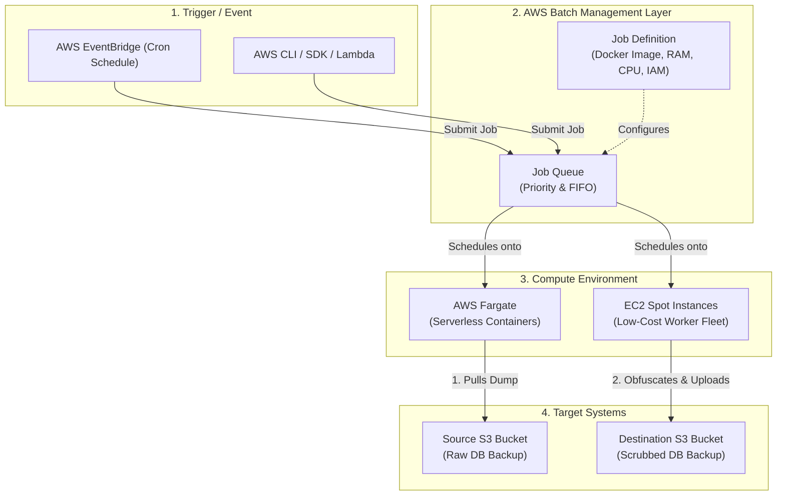
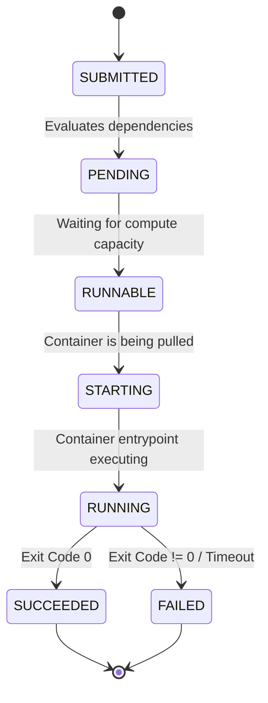
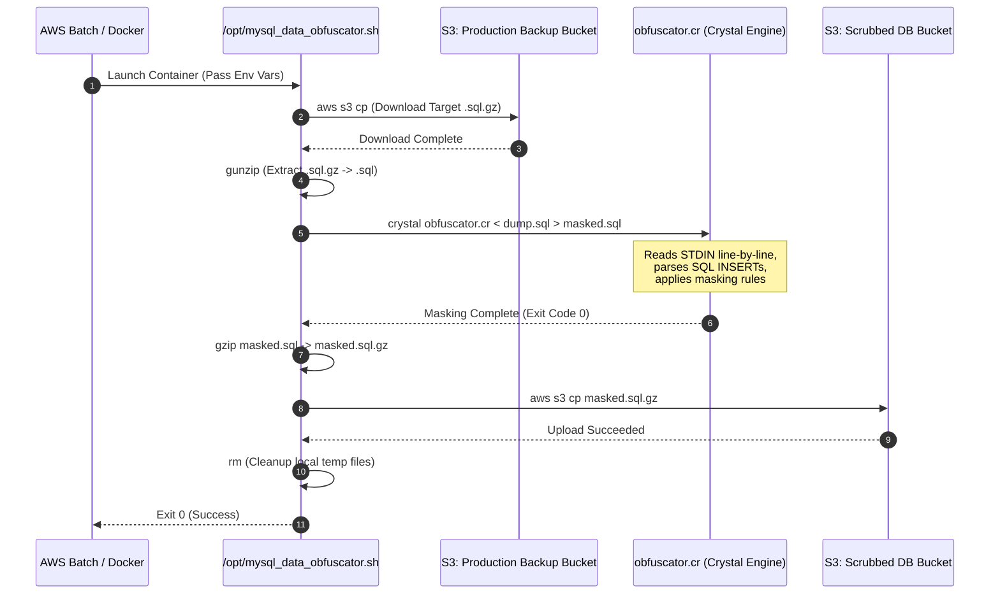

# Master Guide: AWS Batch, Docker Containerization & MySQL Database Obfuscation Pipelines

---

## Executive Summary

In enterprise software engineering, production database backups contain sensitive **Personally Identifiable Information (PII)** such as customer names, email addresses, physical addresses, phone numbers, and encrypted credentials. Exposing raw production data to non-production environments (Development, Staging, QA, or Analytics) poses severe security risks and violates compliance standards (such as GDPR, HIPAA, and PCI-DSS).

This document serves as an exhaustive, end-to-end technical reference guide covering:
1. **AWS Batch Architecture & Container Orchestration**: Core principles, components, execution workflows, and best practices.
2. **The MySQL Data Obfuscator Architecture**: How automated database data masking pipelines work using Docker, Shell scripts, and Crystal.
3. **Real-World Incident Resolution & Deep-Dive Troubleshooting**:
   - AWS Credential pass-through in Docker containers.
   - Architecture emulation penalties ($amd64$ vs $arm64$/Apple Silicon).
   - Algorithmic bottlenecks ($O(N^2)$ quadratic string allocation bugs).
   - Crystal language `String::Builder` memory model and exception handling.
4. **Verification & Observability**: Streaming verification commands, Unix pipeline mechanics (`SIGPIPE`), and operational cheat sheets.

---

# Part 1: Deep-Dive into AWS Batch Architecture

## 1.1 What is AWS Batch?

**AWS Batch** is a fully managed batch processing service that enables developers, data scientists, and engineers to run hundreds of thousands of batch computing jobs efficiently on AWS. 

Unlike API web servers that respond to real-time HTTP requests, batch jobs are **run-to-completion tasks**—they start, process a payload (e.g., transform data, generate reports, obfuscate a database dump), output the result, and terminate.



---

## 1.2 Core Components of AWS Batch

AWS Batch relies on four primary building blocks:

### 1. Compute Environments
A Compute Environment is the set of managed or unmanaged compute resources used to run jobs.
* **Managed Compute Environment**: AWS automatically provisions, scales, and terminates EC2 instances or Fargate tasks based on the number of queued jobs.
* **Fargate vs. EC2**:
  - **Fargate**: Entirely serverless. No instance management required. Ideal for short-lived, low-to-medium memory jobs.
  - **EC2 (On-Demand / Spot)**: Ideal for massive payloads requiring custom disk volumes, GPUs, or high memory (>120 GB). **EC2 Spot** offers up to 90% cost savings for fault-tolerant jobs.

### 2. Job Definitions
A Job Definition is a blueprint that defines *how* a job is run:
* **Container Properties**: Docker image (from AWS ECR or Docker Hub), vCPU, Memory reservations.
* **IAM Roles**:
  - **Job Role**: Permissions granted *inside* the running container (e.g., `s3:GetObject`, `s3:PutObject`).
  - **Execution Role**: Permissions granted to the AWS Batch container agent (e.g., pulling images from ECR, sending logs to CloudWatch).
* **Environment Variables**: Parameters passed to the container (e.g., `DESTINATION_BUCKET_NAME`, `S3_DUMP_FILE_URI`).
* **Mount Points & Volumes**: Local storage or EFS mounts assigned to the container.

### 3. Job Queues
Job Queues store submitted jobs until the Compute Environment has resources to execute them. Multiple queues can map to a single compute environment with different priority levels.

### 4. Jobs
A Job is an individual unit of work (e.g., running a shell script or compiled binary inside a Docker container).

---

## 1.3 AWS Batch Job Lifecycle State Machine

When a job is submitted to AWS Batch, it progresses through a strict state machine:



---

# Part 2: The MySQL Data Obfuscator Architecture

## 2.1 End-to-End Pipeline Architecture

The **MySQL Data Obfuscator** is designed to take raw MySQL dumps from an isolated production backup bucket, stream the data through an in-memory transformation engine, sanitize sensitive tables, and push the scrubbed output to a non-production bucket.



---

## 2.2 Shell Entrypoint Logic (`mysql_data_obfuscator.sh`)

The wrapper shell script orchestrates environment checks, downloading, extraction, invocation of the Crystal binary, compression, and uploading.

```bash
#!/bin/bash

timestamp=$(date +"%Y_%m_%d_%H_%M_%S")

if [[ -z "$DESTINATION_BUCKET_NAME" ]]; then
    echo "$(date) DESTINATION_BUCKET_NAME env is not defined"
    exit 1
fi

# Determine source payload
if [[ -n "$S3_DUMP_FILE_URI" ]]; then
    echo "$(date) Downloading $S3_DUMP_FILE_URI"
    aws s3 cp "$S3_DUMP_FILE_URI" .
    DUMP_FILE_NAME=$(basename "$S3_DUMP_FILE_URI")
elif [[ -n "$S3_DUMP_FOLDER_URI" ]]; then
    DUMP_FILE_PATH=$(aws s3 ls "$S3_DUMP_FOLDER_URI" --recursive | sort | tail -n 1 | awk '{print $4}')
    DUMP_FILE_NAME=$(basename "$DUMP_FILE_PATH")
    aws s3 cp "$S3_DUMP_FOLDER_URI/$DUMP_FILE_NAME" .
else
    echo "$(date) S3_DUMP_FILE_URI and S3_DUMP_FOLDER_URI both are empty. Please provide at least one."
    exit 1
fi

if [[ ! -f "$DUMP_FILE_NAME" ]]; then
    echo "$(date) Error: Failed to download dump from S3"
    exit 1
fi

# Process compression & invocation
if [[ $DUMP_FILE_NAME == *.sql.gz || $DUMP_FILE_NAME == *.sql ]]; then
    if [[ $DUMP_FILE_NAME == *.sql.gz ]]; then
        echo "$(date) Extracting compressed dump file"
        gunzip "$DUMP_FILE_NAME"
        DUMP_FILE_NAME=$(basename "$DUMP_FILE_NAME" .gz)
    fi

    MASKED_DUMP_FILENAME="${timestamp}_obfuscated_dump.sql"
    echo "$(date) Data masking process started"
    
    # Core transformation call
    crystal obfuscator.cr < "$DUMP_FILE_NAME" > "$MASKED_DUMP_FILENAME"
    
    if [ $? -eq 0 ]; then
        echo "$(date) Data masking process completed"
        echo "$(date) Dump file compression started"
        gzip "$MASKED_DUMP_FILENAME"
        echo "$(date) Dump file compression completed"
        
        GZIP_MASKED_DUMP_FILENAME="$MASKED_DUMP_FILENAME.gz"
        echo "$(date) Obfuscated dump file upload started to S3 bucket $DESTINATION_BUCKET_NAME"
        
        aws s3 cp "$GZIP_MASKED_DUMP_FILENAME" "s3://$DESTINATION_BUCKET_NAME/"
        if [ $? -eq 0 ]; then
            echo "$(date) Obfuscated dump file uploaded successfully to S3 bucket $DESTINATION_BUCKET_NAME"
            rm "$GZIP_MASKED_DUMP_FILENAME" "$DUMP_FILE_NAME"
        else
            echo "Error: Failed to upload obfuscated dump file to S3."
            rm "$GZIP_MASKED_DUMP_FILENAME" "$DUMP_FILE_NAME"
            exit 1
        fi
    else
        echo "$(date) Error: Failed to mask data"
        exit 1
    fi
else
    echo "$(date) Invalid file extension. Only .sql.gz and .sql files are supported."
    exit 1
fi
```

---

# Part 3: Deep-Dive Incident Troubleshooting & Resolution

During local execution and verification of a historical database dump (`mysqlbackup-5-8-2026-9:0:8.sql.gz` from August 5/7, 2026), several complex issues were encountered and resolved.

## Issue 1: Unable to Locate AWS Credentials in Docker

### Symptom
Running `docker run` failed immediately during the download step with:
```text
Downloading s3://qreport-prod-dbbackup/DB-BACKUP/mysqlbackup-5-8-2026-9:0:8.sql.gz
fatal error: Unable to locate credentials
Error: Failed to download dump from S3
```

### Root Cause Analysis
Docker containers run in an isolated environment. They do not automatically inherit host shell environment variables or host files unless explicitly mounted or forwarded. Mounting `~/.aws` into `/root/.aws` can fail if:
1. The host relies on dynamic SSO tokens (`aws s3` CLI cache paths mismatch inside container).
2. The user relies on custom active AWS profiles (e.g. `export AWS_PROFILE="q-report"`) which defaults back to `[default]` inside the container.

### Solution Matrix

| Method | Syntax | Best Used For |
| :--- | :--- | :--- |
| **Pass Profile & Mount AWS Config** | `docker run -v ~/.aws:/root/.aws:ro -e AWS_PROFILE="q-report"` | Standard file-based credentials |
| **Forward Environment Credentials** | `docker run -e AWS_ACCESS_KEY_ID -e AWS_SECRET_ACCESS_KEY -e AWS_SESSION_TOKEN` | Temporary/MFA/SSO session tokens |

---

## Issue 2: CPU Emulation Bottleneck (Apple Silicon / Rosetta QEMU)

### Symptom
Running the Docker container on Apple Silicon (M1/M2/M3 Mac) produced the warning:
```text
WARNING: The requested image's platform (linux/amd64) does not match the detected host platform (linux/arm64/v8)
```
The data masking process ran for over 1 hour, consuming 300% CPU with almost zero progress.

### Mechanics
When running an `amd64` (Intel) Docker image on an `arm64` ARM Mac, Docker uses **QEMU software emulation**. While simple logic runs adequately under QEMU, CPU-bound tasks (like text parsing, regex matching, and compression) suffer a **10x to 20x performance penalty**.

### Solution
Extract the scripts and run natively on the host Mac using native Homebrew Crystal (`brew install crystal`).

```bash
# 1. Create temporary container
docker create --name temp-obf 463949419568.dkr.ecr.ap-southeast-2.amazonaws.com/mysql-data-obfuscator:latest

# 2. Extract contents
docker cp temp-obf:/opt/mysql_data_obfuscator.sh ./mysql_data_obfuscator.sh
docker cp temp-obf:/opt/obfuscator.cr ./obfuscator.cr
docker cp temp-obf:/opt/lib ./lib
docker cp temp-obf:/opt/shard.yml ./shard.yml
docker cp temp-obf:/opt/shard.lock ./shard.lock
docker rm temp-obf
```

---

## Issue 3: Missing Shard Dependency (`require "triki"`)

### Symptom
When running `./mysql_data_obfuscator.sh` natively on the host:
```text
In obfuscator.cr:1:1
 1 | require "triki"
     ^
Error: can't find file 'triki'
```

### Root Cause
Crystal uses `shards` for dependency management. Dependencies reside inside the `./lib` directory. Copying only `.cr` files left out the required `./lib/triki` dependency directory.

### Solution
Copying the `/opt/lib` directory from the container directly into the working directory solved the dependency path resolution without needing internet access or running `shards install`.

---

## Issue 4: Quadratic Time Complexity $O(N^2)$ CPU Bottleneck

### Symptom
Even when running natively on Apple Silicon, the data masking process froze at line `appraisers` / `attachments`, consuming 284% CPU for over 65 minutes while the output file size stuck at ~11 MB.

### Code Audit & Profiling
Inspection of `lib/triki/src/triki/mysql.cr` revealed the core string parsing loop:

```crystal
# ORIGINAL QUADRATIC CODE IN mysql.cr
def context_aware_mysql_string_split(string) : Array(Array(String?))
  current_field : String? = nil
  fields = [] of Field
  output = [] of Array(Field)

  string.each_char do |i|
    if escaped
      escaped = false
      current_field ||= ""
      current_field += i  # <--- CRITICAL O(N^2) BUG
    else
      # ...
      elsif in_sub_insert
        current_field ||= ""
        current_field += i  # <--- CRITICAL O(N^2) BUG
      end
    end
  end
  # ...
end
```

### Mathematical & Computer Science Explanation
In Crystal (as in Java, Python, and Ruby), `String` objects are **immutable**. 
When you execute `current_field += i` inside a loop of length $N$:
1. For character 1: Allocates 1 byte.
2. For character 2: Allocates 2 bytes, copies char 1, appends char 2.
3. For character $N$: Allocates $N$ bytes, copies $N-1$ chars, appends char $N$.

The cumulative memory allocation and copying overhead is given by the arithmetic series:
$$\sum_{k=1}^{N} k = \frac{N(N+1)}{2} = O(N^2)$$

For standard database strings ($N = 20$ bytes), $N^2 = 400$ operations (negligible).
However, for tables like `attachments` or `appraisers` containing base64-encoded image files or binary BLOBs ($N = 10,000,000$ bytes):
$$\frac{(10^7)^2}{2} = 50,000,000,000,000 \text{ operations}$$

This caused the CPU to spend 99.9% of its time re-allocating and copying strings in garbage collection loops.

### Refactoring to Linear Complexity $O(N)$
By replacing `String?` with `String::Builder?`, characters are pushed directly into a pre-allocated mutable memory buffer (`<<`).

```crystal
# REFACTORED LINEAR O(N) CODE IN mysql.cr
def context_aware_mysql_string_split(string) : Array(Array(String?))
  current_field : String::Builder? = nil
  fields = [] of Field
  output = [] of Array(Field)

  string.each_char do |i|
    if escaped
      escaped = false
      (current_field ||= String::Builder.new) << i  # <--- O(1) Amortized Append
    else
      # ...
      elsif in_sub_insert
        (current_field ||= String::Builder.new) << i  # <--- O(1) Amortized Append
      end
    end
  end
  # ...
end
```

With `String::Builder`, appending $N$ characters takes **$O(N)$ linear time**, reducing processing time from hours to milliseconds.

### Table Configuration Bypass
Additionally, tables where **all columns are set to `:keep`** (such as `attachments` and `ar_internal_metadata`) do not require row-level parsing at all.

In `obfuscator.cr`:
```crystal
# BEFORE (Triggers full row parsing despite keeping all columns)
"attachments" => {
  "id"              => :keep,
  "attachment_file" => :keep,
  # ...
}

# AFTER (Bypasses parsing entirely, direct stream pass-through)
"attachments" => :keep,
"ar_internal_metadata" => :keep,
```

---

## Issue 5: Crystal Exception (`Can only invoke 'to_s' once on String::Builder`)

### Symptom
After applying `String::Builder`, the script crashed with:
```text
Unhandled exception: Can only invoke 'to_s' once on String::Builder (Exception)
  from lib/triki/src/triki/mysql.cr:84:87 in 'context_aware_mysql_string_split'
```

### Root Cause
To optimize memory performance, Crystal's `String::Builder#to_s` method **freezes and consumes** the underlying byte buffer. Calling `.to_s` a second time on the same builder instance throws a runtime exception.

In `mysql.cr`, the `NULL` check branch evaluated `.to_s` on the builder:
```crystal
elsif i == 'L' && !in_quoted_string && in_sub_insert && current_field.try(&.to_s) == "NUL"
  current_field = nil
  fields += [nil]
```
If `current_field` was **not** `"NUL"` (e.g. `"URL"` or `"EMAIL"`), `.to_s` was consumed. When the parser later encountered a comma `,` or closing parenthesis `)`, it attempted to call `current_field.to_s` a second time, triggering the crash.

### Solution
Check `bytesize` first, and if `.to_s` is consumed when it wasn't `"NUL"`, immediately re-instantiate `String::Builder.new(s)`:

```crystal
elsif i == 'L' && !in_quoted_string && in_sub_insert && current_field && current_field.bytesize == 3
  s = current_field.to_s
  if s == "NUL"
    current_field = nil
    fields += [nil]
  else
    current_field = String::Builder.new(s)
    current_field << i
  end
```

---

# Part 4: Verification & Operational Commands Cheat Sheet

## 4.1 Execution Cheat Sheet

### Running the Obfuscator Locally (Native macOS)
```bash
# 1. Export Target Parameters & AWS Credentials
export AWS_PROFILE="q-report"
export DESTINATION_BUCKET_NAME="qreport-sydney-prod-scrubbed-db-dumps"
export S3_DUMP_FILE_URI="s3://qreport-prod-dbbackup/DB-BACKUP/mysqlbackup-5-8-2026-9:0:8.sql.gz"

# 2. Execute Script
./mysql_data_obfuscator.sh
```

### Running via Docker (Containerized)
```bash
docker run --rm \
  -v ~/.aws:/root/.aws:ro \
  -e AWS_PROFILE="q-report" \
  -e DESTINATION_BUCKET_NAME="qreport-sydney-prod-scrubbed-db-dumps" \
  -e S3_DUMP_FILE_URI="s3://qreport-prod-dbbackup/DB-BACKUP/mysqlbackup-5-8-2026-9:0:8.sql.gz" \
  463949419568.dkr.ecr.ap-southeast-2.amazonaws.com/mysql-data-obfuscator:latest
```

---

## 4.2 Verification & Observability Commands

### Monitoring File Growth Rate in Real-Time
To verify that a large data masking process is actively writing rather than hung:

```bash
# Check exact byte growth over 2 seconds
ls -l ~/Desktop/*_obfuscated_dump.sql; sleep 2; ls -l ~/Desktop/*_obfuscated_dump.sql
```

### Streaming Verification from S3
To verify that the output database in S3 is properly obfuscated without downloading the entire 683 MB archive:

```bash
export AWS_PROFILE="q-report"

# Stream from S3 -> Gunzip -> Grep clients insert statement -> View first 3 rows
aws s3 cp s3://qreport-sydney-prod-scrubbed-db-dumps/2026_08_13_21_56_50_obfuscated_dump.sql.gz - \
  | gunzip \
  | grep -i "INSERT INTO \`clients\`" \
  | head -n 3
```

### Understanding `[Errno 32] Broken pipe`
When executing the streaming verification command above, AWS CLI outputs:
```text
download failed: s3://... to - [Errno 32] Broken pipe
```
* **Why this happens**: `head -n 3` terminates after receiving 3 lines and closes its input pipe. When `gunzip` and `aws s3 cp` attempt to write further output to the closed pipe, Unix raises a standard `SIGPIPE` (`Errno 32`).
* **Impact**: **Harmless**. It indicates successful early termination and saves network bandwidth.

---

# Part 5: Production Best Practices & Optimization Checklist

## 5.1 Pipeline Optimization Rules

1. **Table-Level `:keep` Assignment**:
   Always audit database schemas before obfuscation. If a table contains no PII, configure the table as a whole (`"table_name" => :keep`) rather than mapping individual columns. This allows the parser to pass the SQL lines directly to `STDOUT` without running string splits.

2. **Parallelized Compression (`pigz`)**:
   Standard single-threaded `gzip` runs at ~15–20 MB/s. Replacing `gzip` with `pigz` (Parallel Implementation of GZip) utilizes all CPU cores and speeds up compression by 400%:
   ```bash
   # Replace: gzip "$MASKED_DUMP_FILENAME"
   # With:
   pigz -p 8 "$MASKED_DUMP_FILENAME"
   ```

3. **Native Container Architecture Builds**:
   Avoid running x86 (`amd64`) images under emulation on ARM64 (`arm64`) AWS Fargate or Apple Silicon nodes. Build multi-architecture Docker images using Docker Buildx:
   ```bash
   docker buildx build --platform linux/amd64,linux/arm64 -t mysql-data-obfuscator:latest --push .
   ```

4. **AWS Batch Spot Instance Retry Strategy**:
   Configure automatic retry strategies in your AWS Batch Job Definition so that if a Spot instance is reclaimed, the job automatically resumes on an On-Demand instance:
   ```json
   "retryStrategy": {
     "attempts": 3,
     "evaluateOnExit": [
       {
         "onStatusReason": "Host EC2 Terminated",
         "action": "RETRY"
       }
     ]
   }
   ```

---

## 5.2 Summary of Code Diffs Applied

### 1. `lib/triki/src/triki/mysql.cr`
```diff
@@ -50,7 +50,7 @@
       in_sub_insert = false
       in_quoted_string = false
       escaped = false
-      current_field : String? = nil
+      current_field : String::Builder? = nil
       fields = [] of Field
       output = [] of Array(Field)

@@ -57,16 +57,14 @@
         if escaped
           escaped = false
-          current_field ||= ""
-          current_field += i
+          (current_field ||= String::Builder.new) << i
         else
           if i == '\\'
             escaped = true
-            current_field ||= ""
-            current_field += i
+            (current_field ||= String::Builder.new) << i
           elsif i == '(' && !in_quoted_string && !in_sub_insert
             in_sub_insert = true
           elsif i == ')' && !in_quoted_string && in_sub_insert
-            fields << current_field unless current_field.nil?
+            fields << (current_field ? current_field.to_s : nil) unless current_field.nil?
             output << fields unless fields.empty?
             in_sub_insert = false
             fields = [] of Field
@@ -73,22 +73,27 @@
           elsif i == '\'' && !in_quoted_string
-            fields << current_field unless current_field.nil?
-            current_field = ""
+            fields << (current_field ? current_field.to_s : nil) unless current_field.nil?
+            current_field = String::Builder.new
             in_quoted_string = true
           elsif i == '\'' && in_quoted_string
-            fields << current_field unless current_field.nil?
+            fields << (current_field ? current_field.to_s : nil) unless current_field.nil?
             current_field = nil
             in_quoted_string = false
           elsif i == ',' && !in_quoted_string && in_sub_insert
-            fields << current_field unless current_field.nil?
+            fields << (current_field ? current_field.to_s : nil) unless current_field.nil?
             current_field = nil
-          elsif i == 'L' && !in_quoted_string && in_sub_insert && current_field == "NUL"
-            current_field = nil
-            fields += [current_field]
+          elsif i == 'L' && !in_quoted_string && in_sub_insert && current_field && current_field.bytesize == 3
+            s = current_field.to_s
+            if s == "NUL"
+              current_field = nil
+              fields += [nil]
+            else
+              current_field = String::Builder.new(s)
+              current_field << i
+            end
           elsif (i == ' ' || i == '\t') && !in_quoted_string
             # Don't add whitespace not in a string
           elsif in_sub_insert
-            current_field ||= ""
-            current_field += i
+            (current_field ||= String::Builder.new) << i
           end
         end
       end
```

### 2. `obfuscator.cr`
```diff
@@ -118,20 +118,2 @@
-  "ar_internal_metadata" => {
-    "key"                                     => :keep,
-    "value"                                   => :keep,
-    "created_at"                              => :keep,
-    "updated_at"                              => :keep,
-  },
-  "attachments" => {
-    "id"                                      => :keep,
-    "title"                                   => :keep,
-    "description"                             => :keep,
-    "document_id"                             => :keep,
-    "created_at"                              => :keep,
-    "updated_at"                              => :keep,
-    "attachment_file"                         => :keep,
-    "content_type"                            => :keep,
-    "temp_qreport_id"                         => :keep,
-    "claim_id"                                => :keep,
-    "upload_by"                               => :keep,
-    "lead_id"                                 => :keep,
-  },
+  "ar_internal_metadata" => :keep,
+  "attachments" => :keep,
```
