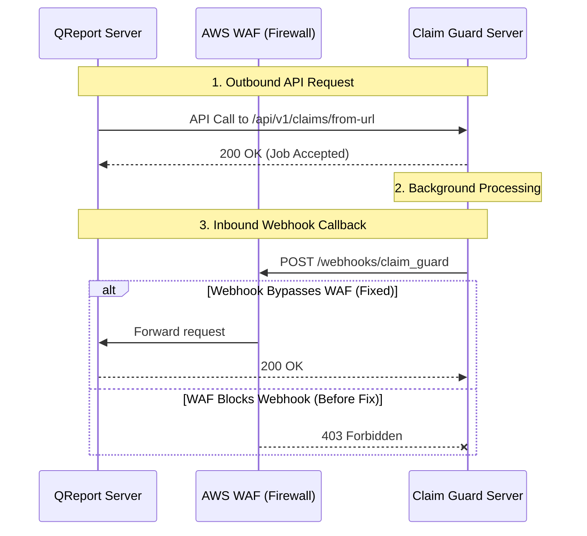

# AWS WAF & Webhook Integration Troubleshooting Guide

This guide explains the integration architecture between **QReport** and **Claim Guard**, why AWS Web Application Firewall (WAF) Bot Control blocked the webhook communication, and how we resolved the issue using WAF Scope-Down Statements.

---

## 1. Core Architecture: What is What?

Understanding the actors and endpoints in this integration:



### The API Endpoint
* **URL:** `https://app.claim-guard.com/api/v1/claims/from-url`
* **Role:** An **outbound** request initiated by QReport. QReport sends data to Claim Guard's server asking them to process a claim using a document URL.

### The Webhook Endpoint
* **URL:** `https://portal-staging.qreport.com.au/webhooks/claim_guard` (Staging) or `/webhooks/claim_guard` (Production)
* **Role:** An **inbound** request initiated by Claim Guard. Because claim analysis takes time, Claim Guard calls this URL on QReport's server in the background once processing is finished to deliver the final results.

---

## 2. What is AWS WAF & Bot Control?

### AWS WAF (Web Application Firewall)
AWS WAF is a cloud-based firewall that protects your application load balancers (ALBs) and CloudFront distributions from common web exploits and unauthorized traffic. It evaluates all incoming requests against a series of defined rules before routing traffic to your application.

### AWS WAF Bot Control
**Bot Control** is an AWS Managed Rule Group designed to protect websites from scrapers, search engines, and malicious automated scripts. Under targeted inspection, it classifies traffic into categories:
1. **Search Engines:** Googlebot, Bingbot (generally allowed).
2. **Advertising/SEO Bots:** Marketing tools (counted or blocked).
3. **HTTP Libraries:** Programmatic clients like `curl`, Python `requests`, `axios`, etc. (typically blocked on sensitive paths).

---

## 3. The Root Cause: Why was the Webhook Blocked?

When Claim Guard sent the webhook callback to your staging server, the request was immediately blocked by WAF with a **`403 Forbidden`** response.

> [!WARNING]
> **The culprit rule:** `CategoryHttpLibrary` inside the `AWSManagedRulesBotControlRuleSet`.

### Why did this happen?
1. **Automated Signature:** Claim Guard's backend system is a machine-to-machine application. It sends webhooks using code-based HTTP libraries (such as Curl, Go-http, Axios, or Ruby Net::HTTP).
2. **Bot Classification:** WAF inspected the request headers (specifically the `User-Agent` and behavior signatures), recognized it was not a human browser, and categorized it as an `HttpLibrary`.
3. **Block Policy:** Because `CategoryHttpLibrary` was set to **Block** in your WAF rule action overrides, the firewall dropped the request.
4. **Log Absence:** Because the block occurred at the WAF level (on the outer boundary of AWS), the request never reached your application server, which is why **no application logs** were generated.

---

## 4. The Solution: Why Choose a Scope-Down Statement?

When configuring WAF to allow a webhook, there are three common approaches. Here is why we chose the **Scope-Down Statement** approach:

| Approach | How it Works | Security Risk | Recommendation |
| :--- | :--- | :--- | :--- |
| **Override to Count** | Changes WAF behavior to count all HTTP library requests instead of blocking them. | **High:** Exposes your entire website to automated scraping, script attacks, and scanners. | ❌ Not Recommended |
| **IP Whitelisting** | Whitelists the outbound IP addresses of Claim Guard in WAF. | **Medium:** Claim Guard's IPs might change dynamically if they use cloud providers, leading to sudden failures. | ⚠️ Maintenance Heavy |
| **Scope-Down Statement** | Tells WAF to run Bot Control everywhere **except** on the webhook URL path. | **Low:** Webhook is allowed while the rest of the site remains fully protected. |  **Recommended** |

### What is a Scope-Down Statement?
A **Scope-Down Statement** acts as a pre-filter for a WAF rule group. It tells WAF: *"Only run the rules in this group on requests that match this specific condition."* 

By setting the condition to **`NOT (URI path starts with /webhooks/claim_guard)`**, we ensure:
* All requests to paths like `/login`, `/dashboard`, and `/admin` still go through WAF Bot Control.
* Inbound webhooks sent to `/webhooks/claim_guard` skip Bot Control checks entirely and are safely processed by the application.

---

## 5. Configuration Templates

### Staging WAF (`qreport-nonproduction-webacl`)
In staging, Bot Control was evaluated for all requests. The fix involved adding a new Scope-Down statement matching the webhook path.

```json
"ScopeDownStatement": {
    "NotStatement": {
        "Statement": {
            "ByteMatchStatement": {
                "SearchString": "/webhooks/claim_guard",
                "FieldToMatch": {
                    "UriPath": {}
                },
                "TextTransformations": [
                    {
                        "Priority": 0,
                        "Type": "NONE"
                    }
                ],
                "PositionalConstraint": "STARTS_WITH"
            }
        }
    }
}
```

### Production WAF (`prod-webACL`)
In production, WAF already had a Scope-Down statement to exclude Tableau domains. We combined the existing exclusions with the webhook exclusion inside an `OrStatement` block:

```json
"ScopeDownStatement": {
    "NotStatement": {
        "Statement": {
            "OrStatement": {
                "Statements": [
                    {
                        "ByteMatchStatement": {
                            "SearchString": "tableau.qreport.com.au",
                            "FieldToMatch": {
                                "SingleHeader": { "Name": "host" }
                            },
                            "TextTransformations": [
                                { "Priority": 0, "Type": "NONE" }
                            ],
                            "PositionalConstraint": "EXACTLY"
                        }
                    },
                    {
                        "ByteMatchStatement": {
                            "SearchString": "tableau-new.qreport.com.au",
                            "FieldToMatch": {
                                "SingleHeader": { "Name": "host" }
                            },
                            "TextTransformations": [
                                { "Priority": 0, "Type": "NONE" }
                            ],
                            "PositionalConstraint": "EXACTLY"
                        }
                    },
                    {
                        "ByteMatchStatement": {
                            "SearchString": "/webhooks/claim_guard",
                            "FieldToMatch": {
                                "UriPath": {}
                            },
                            "TextTransformations": [
                                { "Priority": 0, "Type": "NONE" }
                            ],
                            "PositionalConstraint": "STARTS_WITH"
                        }
                    }
                ]
            }
        }
    }
}
```

---

## 6. Verification Protocol

To verify that the WAF is no longer blocking requests on a specific environment, execute a mock `POST` request using a programmatic client (`curl`):

```bash
curl -i -X POST https://portal.qreport.com.au/webhooks/claim_guard
```

### Verification Matrix

| Response Status | Meaning | Action / Diagnosis | Status |
| :--- | :--- | :--- | :--- |
| **`403 Forbidden`** | **Blocked by WAF** | The request was blocked before reaching your servers. Double-check your Scope-Down statement matching. | ❌ Failed |
| **`401 Unauthorized`** | **Passed WAF, Rejected by App** | **Success.** The request bypassed WAF and reached the backend, which rejected it due to missing tokens. |  Success |
| **`404 Not Found`** | **Passed WAF, Route Missing** | **Success.** The request bypassed WAF and reached the backend, but the webhook path has not yet been deployed in the code. |  Success |
