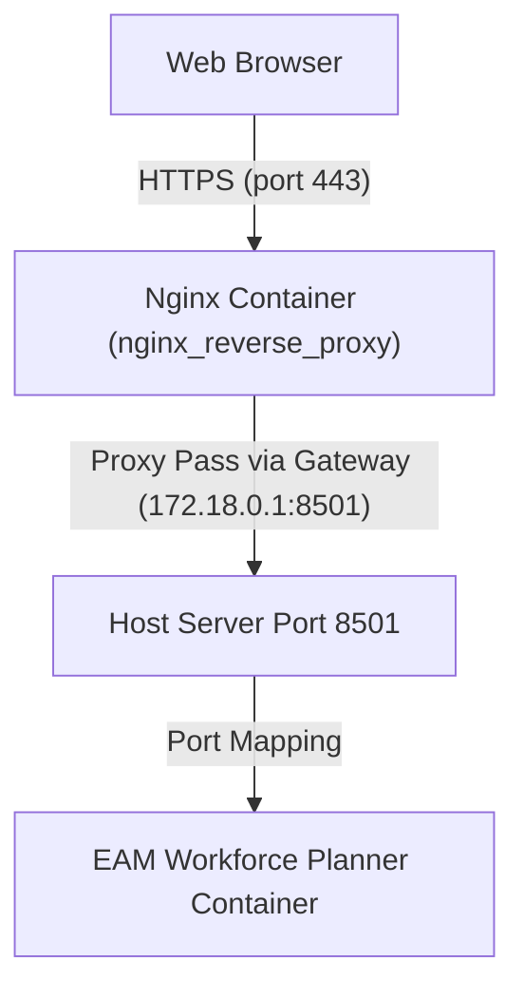

# EAM Workforce Planner Deployment Guide

This guide describes how to deploy the **EAM Workforce Planner** application on the `Microtools-app` server using **Docker Compose** and route it through the existing **Nginx reverse proxy container**.

---

## 1. Architecture Overview

The application is containerized and runs on port `8501`. Since it is built using **Streamlit**, it communicates over WebSockets. The existing `nginx_reverse_proxy` container acts as a gatekeeper, terminating SSL/TLS and reverse-proxying traffic to EAM-DK over the host gateway interface.



---

## 2. Directory Layout

The deployment configurations are organized across two main directories on the server:

```text
/var/www/dkapp/
├── EAM-DK/
│   └── project/
│       ├── docker-compose.yml          # Container configuration
│       ├── doc.dockerfile              # Docker recipe
│       ├── .env                        # Environment credentials (API keys)
│       └── docker/
│           └── streamlit_config.toml   # Streamlit server config
│
└── nginx/
    └── conf.d/
        └── eam-dk.conf                 # Nginx routing template
```

---

## 3. Step-by-Step Deployment

### Step 3.1: Configure Streamlit
Streamlit requires custom network configurations to run headlessly inside Docker without CORS/XSRF issues.

1. Create the configuration directory and file:
   ```bash
   cd /var/www/dkapp/EAM-DK/project
   mkdir -p docker
   nano docker/streamlit_config.toml
   ```
2. Paste the following settings:
   ```toml
   [server]
   headless = true
   port = 8501
   address = "0.0.0.0"
   enableCORS = false
   enableXsrfProtection = false
   ```

### Step 3.2: Configure Environment Variables
Create the environment configuration file:
```bash
nano .env
```
Paste and fill in the necessary keys:
```env
# LLM / Groq API (Required)
GROQ_API_KEY=your_groq_api_key_here

# Translation API (Optional)
TRANSLATION_API_KEY=
TRANSLATION_ENDPOINT=

# Streamlit Port
APP_PORT=8501
```

### Step 3.3: Configure Docker Compose
Create the separate Docker Compose configuration file in the project root:
```bash
nano docker-compose.yml
```
Paste this configuration:
```yaml
version: '3.8'

services:
  eam-planner:
    build:
      context: .
      dockerfile: doc.dockerfile
    container_name: eam-workforce-planner
    ports:
      - "8501:8501"
    env_file:
      - .env
    volumes:
      - ./config:/app/config
      - ./data:/app/data
    command: ["streamlit", "run", "src/app/home.py", "--server.port=8501", "--server.address=0.0.0.0", "--server.headless=true"]
    restart: always
```

### Step 3.4: Build and Start the Application
Run this command to build the image and spin up the container in detached (background) mode:
```bash
docker compose up --build -d
```

---

## 4. Nginx Reverse Proxy Setup

> [!IMPORTANT]
> Because Streamlit relies on WebSockets, the Nginx configuration **must** include headers for `Upgrade` and `Connection` to prevent the UI from getting stuck on "Connecting..." indefinitely.

### Step 4.1: Create Nginx Configuration Template
Go to your Nginx configuration templates folder and create `eam-dk.conf`:
```bash
cd /var/www/dkapp/nginx/conf.d
nano eam-dk.conf
```
Paste the following configurations:
```nginx
# Upstream block pointing to the host's exposed port via the network gateway
upstream eam_upstream {
    server 172.18.0.1:8501;  # 172.18.0.1 is the host bridge gateway
}

# Redirect HTTP to HTTPS
server {
    listen 80;
    server_name scheduler.datakulture.com;

    return 301 https://$host$request_uri;
}

# HTTPS server block
server {
    listen 443 ssl;
    server_name scheduler.datakulture.com;

    # SSL certificates
    ssl_certificate     /etc/nginx/certs/dkchainedbundle.crt;
    ssl_certificate_key /etc/nginx/certs/dk.key;

    # Logs
    access_log  /var/log/nginx/scheduler.datakulture.com_access.log;
    error_log   /var/log/nginx/scheduler.datakulture.com_error.log;

    # Main location routing
    location / {
        proxy_pass http://eam_upstream;
        proxy_http_version 1.1;
        proxy_set_header Host $host;
        proxy_set_header X-Real-IP $remote_addr;
        proxy_set_header X-Forwarded-For $proxy_add_x_forwarded_for;
        proxy_set_header X-Forwarded-Proto $scheme;

        # WebSocket support (CRITICAL for Streamlit)
        proxy_set_header Upgrade $http_upgrade;
        proxy_set_header Connection "upgrade";

        # Set high timeout for heavy LLM processing runs
        proxy_read_timeout 86400;
    }
}
```

### Step 4.2: Reload Nginx Container
Since your Nginx container processes templates on startup, restart it to generate the config files inside `/etc/nginx/conf.d/` and apply them:
```bash
docker restart nginx_reverse_proxy
```

---

## 5. Operations and Troubleshooting

### Checking Status
* Check if the application and reverse proxy are running:
  ```bash
  docker ps
  ```

### Monitoring Logs
* Streamlit/Application logs:
  ```bash
  cd /var/www/dkapp/EAM-DK/project
  docker compose logs -f --tail=100
  ```
* Nginx proxy logs:
  ```bash
  docker logs -f --tail=100 nginx_reverse_proxy
  ```

### Rebuilding After Code Updates
If you update the source code under `/src` and need to rebuild the container:
```bash
cd /var/www/dkapp/EAM-DK/project
docker compose up --build -d
```
