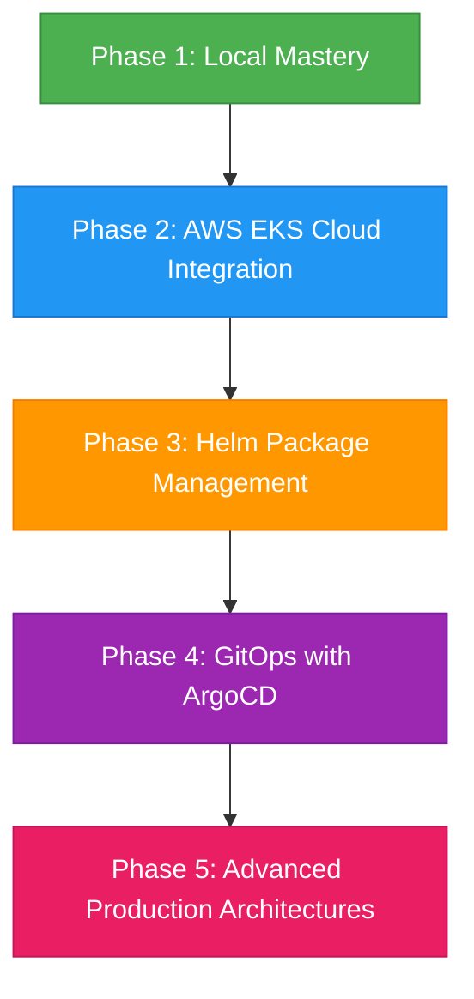
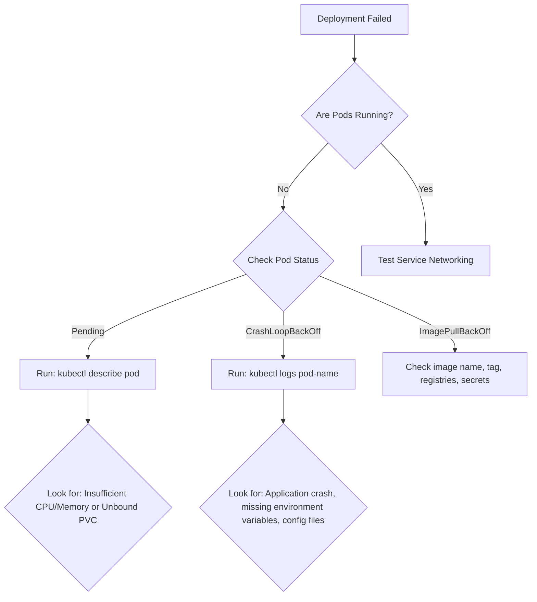
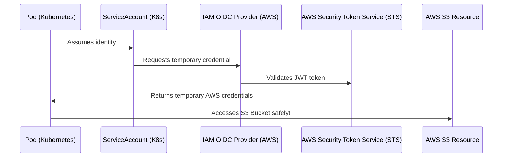
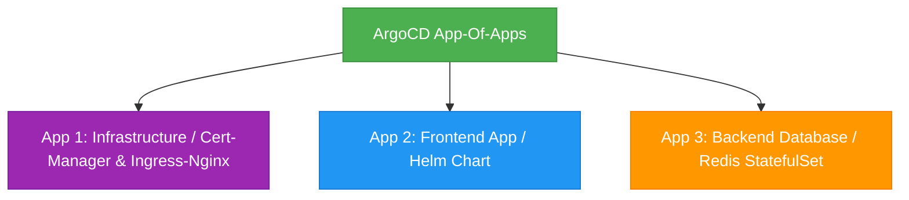

# The Scientific Guide to Mastering Kubernetes: From Local Dev to Production GitOps on AWS EKS

This guide is designed using modern cognitive science principles to help you master Kubernetes (K8s) effectively and permanently. Rather than passive reading, this roadmap leverages **Active Recall**, **Spaced Repetition**, **Interleaved Practice**, and **Project-Based Deliberate Practice**.



---

## 🧠 The Cognitive Science Learning System

To learn Kubernetes effectively, you must abandon the "copy-paste tutorial" trap. We implement three cognitive learning pillars:

1. **The Blank-Page Rule (Active Recall):** Never copy-paste YAML. Write it from memory or use `kubectl run ... --dry-run=client -o yaml` to generate templates, and manually write/edit the rest.
2. **The Feynman Verification:** After learning a concept (e.g., *Services*), explain out loud how a packet travels from outside the cluster to a container inside a Pod. If you stumble, revisit that module.
3. **Interleaved Drills:** Mix commands. Don't just practice deployments; switch back and forth between creating PVCs, debugging logs, and testing networking rules.

---

## 📂 Learning Roadmap Directory
- [Phase 1: Local Cluster Mastery (Beginner to Intermediate)](#phase-1-local-cluster-mastery-beginner-to-intermediate)
- [Phase 2: Scaling to AWS EKS (Intermediate to Advanced)](#phase-2-scaling-to-aws-eks-intermediate-to-advanced)
- [Phase 3: Helm Package Management (Intermediate to Advanced)](#phase-3-helm-package-management-intermediate-to-advanced)
- [Phase 4: GitOps & Continuous Delivery with ArgoCD (Advanced)](#phase-4-gitops--continuous-delivery-with-argocd-advanced)
- [Phase 5: The Master Capstone Project](#phase-5-the-master-capstone-project)
- [🚀 Spaced Repetition Checklist & Kubectl Flashcards](#-spaced-repetition-checklist--kubectl-flashcards)

---

## Phase 1: Local Cluster Mastery (Beginner to Intermediate)

### 1. Pre-requisites & Local Environment Setup
Do not start by deploying to the cloud. Start locally to save costs and achieve fast feedback loops.

#### Tools to Install
*   **Docker Desktop** or **Rancher Desktop**: Container runtime daemon.
*   **kubectl**: The Kubernetes command-line tool.
*   **Kind (Kubernetes in Docker)** (Recommended) or **Minikube**: Spins up multi-node local clusters inside Docker containers in seconds.
*   **k9s**: A terminal UI that helps you visualize and interact with your cluster (crucial for productivity!).

#### Command Setup (Kind)
Create a multi-node cluster config locally to simulate production environments:
```yaml
# kind-config.yaml
kind: Cluster
apiVersion: kind.x-k8s.io/v1alpha4
nodes:
- role: control-plane
- role: worker
- role: worker
```
Spin it up:
```bash
kind create cluster --config kind-config.yaml --name dev-cluster
kubectl cluster-info --context kind-kind-dev-cluster
```

---

### 2. The Core 8 Kubernetes Objects
Master these 8 objects. You must be able to write and explain them.

```
       +-------------------------------------------------+
       |                     Ingress                     |
       +------------------------+------------------------+
                                |
                                v
       +-------------------------------------------------+
       |                     Service                     |
       +------------------------+------------------------+
                                |
                                v
       +-------------------------------------------------+
       |                   Deployment                    |
       +------------------------+------------------------+
                                |
                                v
       +------------------------+------------------------+
       |                      Pods                       |
       |  +------------------+     +------------------+  |
       |  |  App Container   |<--->|  Config/Secrets  |  |
       |  +--------+---------+     +------------------+  |
       |           | PersistentVolumeClaim               |
       +-----------+-------------------------------------+
                   |
                   v
       +-------------------------------------------------+
       |                PersistentVolume                 |
       +-------------------------------------------------+
```

#### ① Pod
The smallest deployable unit. Usually wraps a single container.
*   **Active Recall Task:** Write a Pod spec for `nginx:alpine` without looking at docs.
```yaml
apiVersion: v1
kind: Pod
metadata:
  name: web-pod
  labels:
    app: frontend
spec:
  containers:
  - name: web-container
    image: nginx:alpine
    ports:
    - containerPort: 80
```

#### ② Deployment
Manages Pod replicas, handles rollouts (rolling updates), and rollbacks.
```yaml
apiVersion: apps/v1
kind: Deployment
metadata:
  name: web-deployment
spec:
  replicas: 3
  selector:
    matchLabels:
      app: web
  template:
    metadata:
      labels:
        app: web
    spec:
      containers:
      - name: nginx
        image: nginx:1.25.1
        ports:
        - containerPort: 80
```

#### ③ Service (ClusterIP, NodePort, LoadBalancer)
Provides stable networking IPs and DNS resolution to dynamic Pods.
*   **ClusterIP (Default):** Accessible only inside the cluster.
*   **NodePort:** Exposes service on static port on each Node's IP.
*   **LoadBalancer:** Integrates with cloud provider to provision public load balancers.

#### ④ ConfigMap & ⑤ Secret
Decouples environment configuration and sensitive passwords/keys from code.
> [!IMPORTANT]
> Secrets are base64-encoded, NOT encrypted by default. Never commit raw Secrets to Git.

#### ⑥ PersistentVolume (PV) & ⑦ PersistentVolumeClaim (PVC)
Manages storage lifecycle. PV is the actual storage disk provisioned; PVC is the user's request for storage.

#### ⑧ Ingress
An API object that manages external access to services, typically HTTP/HTTPS routing, acting as an application layer (L7) load balancer.

---

### 3. Debugging Diagnostics Flowchart
When a application deployment fails, run these diagnostics in order:



---

## Phase 2: Scaling to AWS EKS (Intermediate to Advanced)

Transitioning to production means moving to a Managed Kubernetes service. Amazon EKS (Elastic Kubernetes Service) is the industry standard.

### EKS Architecture
*   **Control Plane:** Managed by AWS, replicated across multiple Availability Zones (AZs).
*   **Data Plane:** Worker nodes running inside your VPC. Options:
    *   **Managed Node Groups:** EC2 instances managed by AWS EKS auto-scaling.
    *   **AWS Fargate:** Serverless container compute (no EC2 instances to manage).

```
 +-----------------------------------------------------------------------+
 |                             AWS Cloud                                 |
 |                                                                       |
 |   +---------------------------------------------------------------+   |
 |   |                         Amazon EKS                            |   |
 |   |   +-------------------------------------------------------+   |   |
 |   |   |                  EKS Control Plane                    |   |   |
 |   |   |      (Managed etcd, API Server, Scheduler, etc.)      |   |   |
 |   |   +---------------------------+---------------------------+   |   |
 |   |                               |                               |   |
 |   |   +---------------------------v---------------------------+   |   |
 |   |   |                    Worker Nodes                       |   |   |
 |   |   |   +--------------------------+  +------------------+  |   |   |
 |   |   |   |  Managed Node Groups     |  |   AWS Fargate    |  |   |   |
 |   |   |   |  (EC2 instances inside)  |  |   (Serverless)   |  |   |   |
 |   |   |   +--------------------------+  +------------------+  |   |   |
 |   |   +-------------------------------------------------------+   |   |
 |   +---------------------------------------------------------------+   |
 +-----------------------------------------------------------------------+
```

### 1. Installation of EKS Tools
Install these on your local system:
*   **AWS CLI:** For interacting with AWS services.
*   **eksctl:** The official CLI tool for creating and managing EKS clusters.

Configure AWS credentials:
```bash
aws configure
```

---

### 2. Provisioning an EKS Cluster (Declaratively)
Create an EKS cluster using a configuration file instead of AWS Console clicks (Infrastructure as Code).

```yaml
# eks-cluster-spec.yaml
apiVersion: eksctl.io/v1alpha5
kind: ClusterConfig

metadata:
  name: prod-eks-cluster
  region: us-west-2
  version: "1.30"

managedNodeGroups:
  - name: general-purpose-nodes
    instanceType: t3.medium
    desiredCapacity: 3
    minSize: 2
    maxSize: 5
    volumeSize: 30
    privateNetworking: true
    labels: { role: worker }
    tags:
      nodegroup-role: worker
```
Create the cluster:
```bash
eksctl create cluster -f eks-cluster-spec.yaml
```
*Note: This process usually takes 15-20 minutes as it sets up the VPC, subnets, NAT gateways, Security Groups, and EC2 nodes.*

Once created, update your local config to point to the EKS cluster:
```bash
aws eks update-kubeconfig --region us-west-2 --name prod-eks-cluster
```

---

### 3. Production Integrations (The EKS Pillars)

#### 🛡️ AWS IAM Roles for Service Accounts (IRSA)
*   **The Problem:** How do Pods securely access AWS resources (S3, RDS, DynamoDB)?
*   **The Solution:** Do NOT embed AWS Access Keys in K8s Secrets. Use IRSA. You map an AWS IAM Role directly to a Kubernetes ServiceAccount using OpenID Connect (OIDC).



**Implementation Steps:**
1. Associate IAM OIDC provider with your EKS cluster:
   ```bash
   eksctl utils associate-iam-oidc-provider --cluster prod-eks-cluster --approve
   ```
2. Create an IAM Policy with required S3 permissions:
   ```json
   {
     "Version": "2012-10-17",
     "Statement": [
       {
         "Effect": "Allow",
         "Action": ["s3:GetObject", "s3:PutObject"],
         "Resource": "arn:aws:s3:::my-production-app-bucket/*"
       }
     ]
   }
   ```
3. Create the K8s Service Account bound to an AWS IAM Role:
   ```bash
   eksctl create iamserviceaccount \
     --name app-s3-serviceaccount \
     --namespace default \
     --cluster prod-eks-cluster \
     --attach-policy-arn arn:aws:iam::123456789012:policy/MyS3Policy \
     --approve \
     --override-existing-serviceaccounts
   ```
4. Attach the ServiceAccount to your Pod spec:
   ```yaml
   spec:
     serviceAccountName: app-s3-serviceaccount
     containers:
     - name: app
       image: my-app-image:latest
   ```

#### 🌐 EKS Networking & Application Ingress
AWS requires the **AWS Load Balancer Controller** to manage Application Load Balancers (ALB) and Network Load Balancers (NLB).

1. Install the controller inside EKS using Helm (covered in Phase 3).
2. Write a production Ingress manifest:
```yaml
apiVersion: networking.k8s.io/v1
kind: Ingress
metadata:
  name: app-ingress
  namespace: default
  annotations:
    kubernetes.io/ingress.class: alb
    alb.ingress.kubernetes.io/scheme: internet-facing
    alb.ingress.kubernetes.io/target-type: ip
spec:
  rules:
  - http:
      paths:
      - path: /
        pathType: Prefix
        backend:
          service:
            name: app-service
            port:
              number: 80
```

---

## Phase 3: Helm Package Management (Intermediate to Advanced)

### Why Helm?
If you have 10 microservices, each with a Deployment, Service, PVC, ConfigMap, and Ingress, you have 50+ YAML files. Keeping track of environment changes (dev, staging, prod) becomes impossible. Helm resolves this.

*   **Chart:** A bundle of template manifests.
*   **Values:** Environment-specific configuration files (`values.yaml`, `values-prod.yaml`).
*   **Release:** A running instance of a Chart in the cluster.

```
                  +-------------------+
                  |   Helm Template   |
                  +---------+---------+
                            |
                            +<------------+ Interpolates
                            |             |
                  +---------v---------+   |   +-------------------+
                  |    values.yaml    +---+   |    values-prod    |
                  +---------+---------+       +-------------------+
                            |
                            v
                  +-------------------+
                  |  Rendered YAML    |
                  +---------+---------+
                            |
                            v  (helm install)
                  +-------------------+
                  | EKS Cluster State |
                  +-------------------+
```

---

### 1. Structure of a Helm Chart
Create your first chart structure:
```bash
helm create my-webapp
```
This generates the following directory structure:
*   `Chart.yaml`: Contains metadata about your application (name, description, version).
*   `values.yaml`: Default configuration values.
*   `templates/`: Directory containing templates for resources (e.g., `deployment.yaml`, `service.yaml`).
*   `charts/`: Directory containing dependent charts.

---

### 2. Templating Your YAML
Inside `templates/deployment.yaml`, modify static strings to dynamic parameters:
```yaml
apiVersion: apps/v1
kind: Deployment
metadata:
  name: {{ include "my-webapp.fullname" . }}
spec:
  replicas: {{ .Values.replicaCount }}
  template:
    spec:
      containers:
      - name: {{ .Chart.Name }}
        image: "{{ .Values.image.repository }}:{{ .Values.image.tag | default .Chart.AppVersion }}"
```

Define configuration settings in `values.yaml`:
```yaml
replicaCount: 3
image:
  repository: nginx
  tag: "1.25-alpine"
```

---

### 3. Releasing Charts
Install, upgrade, and rollback applications using Helm:
```bash
# Preview the dry-run of the rendered manifests
helm install webapp-dev ./my-webapp --dry-run --debug

# Install the application
helm install webapp-dev ./my-webapp -f values.yaml --namespace dev --create-namespace

# Upgrade release to new version
helm upgrade webapp-dev ./my-webapp -f values-prod.yaml

# Rollback deployment instantly in case of issues
helm rollback webapp-dev 1
```

---

## Phase 4: GitOps & Continuous Delivery with ArgoCD (Advanced)

### The GitOps Paradigm
Traditional pipelines run `kubectl apply -f manifests` inside CI/CD runners (like Jenkins or GitHub Actions). This creates security risks (runners require admin cluster access) and leads to configuration drift.

**GitOps** shifts reconciliation:
*   **Git** is the single source of truth for the system's state.
*   **ArgoCD** sits *inside* the cluster, monitors the Git repository, detects differences between Git and the Cluster, and pulls the changes to synchronize state.

```
+---------------+      Push      +---------------+
|  Git Commit   +--------------->|   GitHub      |
+---------------+                +-------+-------+
                                         |
                                         | Reads (Poll / Webhook)
                                         v
+---------------+  Reconciles    +---------------+
| EKS Cluster   |<---------------+    ArgoCD     |
+---------------+                +---------------+
```

---

### 1. Setting Up ArgoCD on EKS
Create a namespace and install the official ArgoCD distribution:
```bash
kubectl create namespace argocd
kubectl apply -n argocd -f https://raw.githubusercontent.com/argoproj/argo-cd/stable/manifests/install.yaml
```

Access the ArgoCD API Server:
1. Port-forward the dashboard:
   ```bash
   kubectl port-forward svc/argocd-server -n argocd 8080:443
   ```
2. Retrieve the default admin password:
   ```bash
   kubectl -n argocd get secret argocd-initial-admin-secret -o jsonpath="{.data.password}" | base64 -d
   ```

---

### 2. Creating a GitOps Application
Write a declarative manifest that instructs ArgoCD to watch your Git repository (which contains your Helm chart) and deploy it to EKS.

```yaml
# argocd-application.yaml
apiVersion: argoproj.io/v1alpha1
kind: Application
metadata:
  name: ecommerce-app
  namespace: argocd
spec:
  project: default
  source:
    repoURL: 'https://github.com/my-org/kubernetes-infrastructure-repo.git'
    targetRevision: HEAD
    path: charts/my-webapp
    helm:
      valueFiles:
        - values-prod.yaml
  destination:
    server: 'https://kubernetes.default.svc'
    namespace: production
  syncPolicy:
    automated:
      prune: true      # Delete resources no longer in Git
      selfHeal: true   # Overwrite manual changes in cluster automatically
```
Deploy the Application config to ArgoCD:
```bash
kubectl apply -f argocd-application.yaml
```
ArgoCD will now monitor your repository. Every time you push a code or configuration change (e.g. updating image tags) to Git, ArgoCD will reconcile it automatically within seconds.

---

## Phase 5: The Master Capstone Project

Now, put everything together. Build a production-grade multi-environment pipeline.

### Project Architecture
Build an **App of Apps** pattern that sets up:
*   A backend microservice.
*   A frontend client.
*   A stateful service (Redis) with dynamic storage PVC.



### Steps to Implement

#### 1. Setup Your Infrastructure Repository
Create a directory structure in a new GitHub repository:
```text
infrastructure-repo/
├── bootstrap/
│   └── root-application.yaml  <-- App of Apps Root
├── charts/
│   ├── webapp/
│   │   ├── Chart.yaml
│   │   ├── values.yaml
│   │   └── templates/
│   └── database/
│       ├── Chart.yaml
│       ├── values.yaml
│       └── templates/
└── environments/
    ├── dev/
    │   └── values-dev.yaml
    └── prod/
        └── values-prod.yaml
```

#### 2. Declare the App of Apps Config
```yaml
# root-application.yaml
apiVersion: argoproj.io/v1alpha1
kind: Application
metadata:
  name: root-app
  namespace: argocd
spec:
  project: default
  source:
    repoURL: 'https://github.com/YOUR_GIT_USER/infrastructure-repo.git'
    targetRevision: HEAD
    path: bootstrap
  destination:
    server: 'https://kubernetes.default.svc'
    namespace: argocd
  syncPolicy:
    automated:
      prune: true
      selfHeal: true
```

#### 3. Push and Observe Sync Loops
1. Apply the root application: `kubectl apply -f root-application.yaml`
2. Open your ArgoCD terminal UI or web console.
3. Watch the cascades: The root application spins up child applications, which in turn provision Deployments, Services, and Secrets in their respective namespaces.
4. Scale replica counts in Git and push. Watch the rolling updates happen automatically.

---

## 🚀 Spaced Repetition Checklist & Kubectl Flashcards

Test yourself on these commands. Do not look at the answers. Use them for active recall review on Day 1, Day 3, Day 7, and Day 30.

### Kubectl Diagnostics Run

| Question (Active Recall) | Command Answer |
| :--- | :--- |
| **How do you run a temporary debug Pod?** | `kubectl run tmp-debug --image=busybox -i --tty --rm -- sh` |
| **How do you print logs with timestamps?** | `kubectl logs <pod-name> --timestamps=true` |
| **How do you view live events of a cluster?** | `kubectl get events --watch` |
| **How do you scale a Deployment to 5 replicas dynamically?** | `kubectl scale deployment/<name> --replicas=5` |
| **How do you check API resources and their abbreviations?** | `kubectl api-resources` |
| **How do you print container resources usage (CPU/Memory)?** | `kubectl top pod` |
| **How do you output a running deployment to yaml config?** | `kubectl get deployment/<name> -o yaml > deployment.yaml` |

### Feynman Knowledge Checklists
*   [ ] Can I explain the difference between a Pod and a Container?
*   [ ] Can I explain how a Service routes traffic to target pods using selectors?
*   [ ] Can I explain the EKS OpenID Connect authentication path for Service Accounts?
*   [ ] Can I describe the reconciliation process ArgoCD uses to check for configuration drifts?
*   [ ] Can I explain why Helm charts are more suitable for production compared to writing raw Kubernetes manifests?
