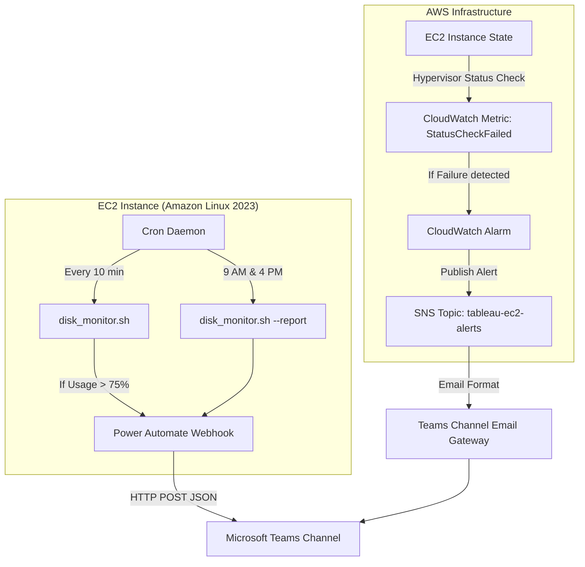

# Tableau EC2 Monitoring & Microsoft Teams Alerting System Report

This report outlines the complete architecture, setup instructions, advantages, working mechanisms, costs, and potential failure modes of the two complementary monitoring systems implemented for your Tableau EC2 instance.



---

## System Architecture Overview

To provide maximum reliability, the monitoring is split into two independent, complementary layers:
1. **OS-Level Monitoring (Internal)**: Tracks disk storage space and RAM memory utilizing a local cron script, communicating directly with Teams using JSON Adaptive Cards.
2. **Hypervisor-Level Monitoring (External)**: Tracks the physical health and boot state of the virtual machine from outside the OS, utilizing native AWS CloudWatch and SNS, communicating with Teams via its email gateway.

---

## Part 1: Disk Space & Memory Monitoring (OS-Level)

### Working Mechanism
* A shell script `/usr/local/bin/disk_monitor.sh` is scheduled to run in the background using the Linux `cron` daemon.
* **Monitor Mode (Every 10 minutes)**: The script queries the filesystem using `df`. If the root partition `/` exceeds `75%`, it builds a JSON payload in the **Microsoft Teams Adaptive Card** schema and sends a `POST` request to the Power Automate Webhook. If the disk space is healthy, it exits silently.
* **Report Mode (9:00 AM & 4:00 PM daily)**: The script runs with the `--report` flag. It bypasses the threshold check, cleanses and formats outputs from `free -h` (RAM) and `df -h` (Disks), and pushes a green-labeled system status report card directly to Teams.

### Advantages
* **Premium Presentation**: Leverages MS Teams Adaptive Cards to display neat, color-coded, readable alerts rather than raw text.
* **Information Rich**: Shows system metadata like Hostname, AWS Instance ID (via IMDSv2 query), and local IP address.
* **High Security**: Does not require opening incoming ports; all traffic is outbound over HTTPS.

### Faults & Limitations
* **Crash Blindness**: If the operating system experiences a kernel panic, freezes, or loses network connectivity, the local cron job cannot run, and no warning alerts will be sent.
* **Dependency on Outbound Internet**: Requires the instance to have outbound internet access (via NAT Gateway or Public IP) to reach the Power Automate API.

### Implementation Guide

#### 1. Teams Webhook Configuration
* In Microsoft Teams, go to your target channel, select **Workflows** -> search for the template **"Post to a channel when a webhook request is received"**.
* Name the connection and save the generated URL.

#### 2. Shell Script Deployment
Create `/usr/local/bin/disk_monitor.sh` on the EC2 instance:
```bash
#!/bin/bash

# Configuration
THRESHOLD=75
DISK_PARTITION="/"
WEBHOOK_URL="https://defaultd2624b5b89fd468eb5046570779aa3.b6.environment.api.powerplatform.com:443/powerautomate/automations/direct/workflows/1fd3da521d7549818936b7bb08703337/triggers/manual/paths/invoke?api-version=1&sp=%2Ftriggers%2Fmanual%2Frun&sv=1.0&sig=hdE8IkqFcUHR9riqJ0qdfohdSYIWHvwEn74EuJ3pJvs"

# Get server hostname and IP address
HOSTNAME=$(hostname)
IP_ADDR=$(hostname -I | awk '{print $1}')

# Fetch AWS EC2 Instance ID using metadata service (IMDSv2)
TOKEN=$(curl -s -X PUT "http://169.254.169.254/latest/api/token" -H "X-aws-ec2-metadata-token-ttl-seconds: 60")
INSTANCE_ID=$(curl -s -H "X-aws-ec2-metadata-token: $TOKEN" http://169.254.169.254/latest/meta-data/instance-id)

# If IMDSv2 fails, default to hostname
if [ -z "$INSTANCE_ID" ]; then
    INSTANCE_ID=$HOSTNAME
fi

# Check disk usage percentage (gets the number only, e.g. 42)
CURRENT_USAGE=$(df -h "$DISK_PARTITION" | grep -v Filesystem | awk '{print $5}' | sed 's/%//g')

if [ -z "$CURRENT_USAGE" ]; then
    echo "Error: Could not retrieve disk usage for $DISK_PARTITION"
    exit 1
fi

send_emergency_alert() {
    PAYLOAD=$(cat <<EOF
{
  "type": "AdaptiveCard",
  "version": "1.4",
  "\$schema": "http://adaptivecards.io/schemas/adaptive-card.json",
  "body": [
    {
      "type": "Container",
      "style": "attention",
      "items": [
        {
          "type": "TextBlock",
          "text": "🚨 Disk Space Warning: Tableau Server",
          "weight": "Bolder",
          "size": "Medium",
          "style": "heading"
        }
      ]
    },
    {
      "type": "FactSet",
      "facts": [
        { "title": "Instance ID:", "value": "${INSTANCE_ID}" },
        { "title": "Hostname:", "value": "${HOSTNAME}" },
        { "title": "IP Address:", "value": "${IP_ADDR}" },
        { "title": "Partition:", "value": "${DISK_PARTITION}" },
        { "title": "Current Usage:", "value": "${CURRENT_USAGE}%" },
        { "title": "Threshold:", "value": "${THRESHOLD}%" }
      ]
    },
    {
      "type": "TextBlock",
      "text": "Please log in and free up space immediately to avoid Tableau Server failure.",
      "weight": "Bolder",
      "wrap": true
    }
  ]
}
EOF
)
    curl -X POST -H "Content-Type: application/json" -d "$PAYLOAD" "$WEBHOOK_URL"
}

send_status_report() {
    RAM_REPORT_ESC=$(free -h | sed 's/"/\\"/g' | awk '{printf "%s\\n", $0}')
    DISK_REPORT_ESC=$(df -h -x tmpfs -x devtmpfs -x squashfs | sed 's/"/\\"/g' | awk '{printf "%s\\n", $0}')

    PAYLOAD=$(cat <<EOF
{
  "type": "AdaptiveCard",
  "version": "1.4",
  "\$schema": "http://adaptivecards.io/schemas/adaptive-card.json",
  "body": [
    {
      "type": "Container",
      "style": "good",
      "items": [
        {
          "type": "TextBlock",
          "text": "✅ Scheduled System Status Report",
          "weight": "Bolder",
          "size": "Medium",
          "style": "heading"
        }
      ]
    },
    {
      "type": "FactSet",
      "facts": [
        { "title": "Instance ID:", "value": "${INSTANCE_ID}" },
        { "title": "Hostname:", "value": "${HOSTNAME}" },
        { "title": "IP Address:", "value": "${IP_ADDR}" },
        { "title": "Disk Status:", "value": "${CURRENT_USAGE}% (Threshold: ${THRESHOLD}%)" }
      ]
    },
    {
      "type": "TextBlock",
      "text": "📊 **RAM Memory Status**",
      "weight": "Bolder"
    },
    {
      "type": "TextBlock",
      "text": "\`\`\`\\n${RAM_REPORT_ESC}\\n\`\`\`",
      "fontType": "Monospace",
      "wrap": true
    },
    {
      "type": "TextBlock",
      "text": "💾 **Disk Volumes Status**",
      "weight": "Bolder"
    },
    {
      "type": "TextBlock",
      "text": "\`\`\`\\n${DISK_REPORT_ESC}\\n\`\`\`",
      "fontType": "Monospace",
      "wrap": true
    }
  ]
}
EOF
)
    curl -X POST -H "Content-Type: application/json" -d "$PAYLOAD" "$WEBHOOK_URL"
}

if [ "$1" == "--report" ]; then
    send_status_report
else
    if [ "$CURRENT_USAGE" -gt "$THRESHOLD" ]; then
        send_emergency_alert
    fi
fi
```
Configure permissions: `sudo chmod +x /usr/local/bin/disk_monitor.sh`

#### 3. Cron Daemon Installation & Automation (AL2023)
```bash
# Install and start cron on Amazon Linux 2023
sudo dnf install cronie -y
sudo systemctl enable crond
sudo systemctl start crond

# Edit system scheduler
sudo crontab -e
```
Paste these two lines at the bottom:
```cron
*/10 * * * * /bin/bash /usr/local/bin/disk_monitor.sh > /dev/null 2>&1
0 9,16 * * * /bin/bash /usr/local/bin/disk_monitor.sh --report > /dev/null 2>&1
```

#### 4. Testing Commands
```bash
# Test 1: Send a manual test report card to Teams immediately
/usr/local/bin/disk_monitor.sh --report

# Test 2: Trigger emergency alert (temporarily lower threshold to 1%)
sudo sed -i 's/THRESHOLD=75/THRESHOLD=1/g' /usr/local/bin/disk_monitor.sh
/usr/local/bin/disk_monitor.sh
sudo sed -i 's/THRESHOLD=1/THRESHOLD=75/g' /usr/local/bin/disk_monitor.sh
```

---

## Part 2: Instance Uptime Monitoring (AWS Hypervisor-Level)

### Working Mechanism
* AWS hypervisors automatically perform two status checks on EC2 instances: **System Status Checks** (physical hardware host issues) and **Instance Status Checks** (operating system errors, crash, boot configuration errors).
* If either check fails, the metric `StatusCheckFailed` becomes `1`.
* A **CloudWatch Alarm** continuously monitors this metric. If it stays at `1` for 1 minute, the alarm transitions to `ALARM` state and sends a notification payload to an **Amazon SNS Topic**.
* An **Email subscription** is created on the SNS topic pointing to the **Teams Channel email gateway address**.
* SNS publishes the raw alarm notification text directly to the Teams email address, causing Teams to instantly post it as an email snippet card inside the channel.

### Advantages
* **High Resilience**: Works even if the virtual machine is completely crashed, frozen, powered off, or experiencing a kernel panic (since AWS manages the metric externally).
* **Zero Scripting**: Requires no custom agents or coding on the instance itself.
* **Native Teams Integration**: Bypasses the need for Chatbot setup, IAM roles, or AWS Lambda translators.

### Faults & Limitations
* **Slight Delay**: It takes roughly 1–2 minutes for CloudWatch to evaluate the metric state and trigger the alarm.
* **Basic Formatting**: The email snippet posted to Teams will contain raw JSON-like text detailing the alarm metadata, which is less visually styled than Adaptive Cards.

### Implementation Guide

1. **Retrieve Teams Channel Email**:
   * Click `...` next to the Teams channel name -> click **Get email address**. Copy this address.
2. **Create AWS SNS Topic**:
   * Go to **AWS Console > SNS > Topics > Create Topic**.
   * Select **Standard**, name it `tableau-ec2-alerts`, and click **Create**.
   * Inside the topic, click **Create Subscription**.
   * Select **Email** as the Protocol, paste your **Teams Email** in the Endpoint field, and click **Create Subscription**.
   * Open Microsoft Teams. Find the confirmation email sent by AWS SNS inside your channel and click **Confirm subscription**.
3. **Configure CloudWatch Alarm**:
   * Go to **CloudWatch > Alarms > Create Alarm**.
   * Click **Select metric** -> Go to **EC2 > Per-Instance Metrics** -> Search for your instance ID -> select **`StatusCheckFailed`**.
   * Set **Statistic** to `Maximum` and **Period** to `1 minute`.
   * Under Conditions, set **Threshold type** to `Static`, select **Greater/Equal to**, and enter `1`.
   * Under Actions, set **Alarm state trigger** to `In alarm`, select **Select an existing SNS topic**, and choose `tableau-ec2-alerts`.
   * Click **Next**, name the alarm `Tableau-EC2-Crash-Alert`, and click **Create Alarm**.

---

## Cost Analysis Table

All costs are calculated based on typical usage for a single EC2 instance monitor.

| Service Component | Quantity/Frequency | Free Tier Coverage | Monthly Cost (Post Free Tier) |
| :--- | :--- | :--- | :--- |
| **Local Script Execution** | Every 10 minutes | Unlimited (0% host CPU/Disk impact) | **$0.00** |
| **Power Automate (Teams Workflows)** | 144 checks/day, 2 reports/day | Included with Microsoft 365 license | **$0.00** (Included in MS Teams) |
| **AWS CloudWatch Metric** | `StatusCheckFailed` (Every 1 min) | 100% Free forever (Default host metric) | **$0.00** |
| **AWS CloudWatch Alarm** | 1 Alarm | 10 metric alarms free per month | **$0.10** per month (if Free Tier exceeded) |
| **AWS SNS Email Publish** | ~0 to 10 alerts/month | First 1,000,000 requests/month free | **$0.00** (Negligible) |
| **Total Estimated Cost** | — | **$0.00 / month** | **$0.10 / month** |

---

## Troubleshooting & Maintenance

> [!WARNING]
> **AWS IMDSv2 Transition:** This script uses the newer, secure IMDSv2 metadata token standard. If the script fails to retrieve the Instance ID, verify that IMDSv2 is not disabled on your EC2 instance (check EC2 console -> Instance Details -> Actions -> Instance Settings -> Modify Instance Metadata Options).

> [!NOTE]
> **No Log Rotation Needed:** Because we configured the cron job to redirect standard output and errors to `/dev/null` (`> /dev/null 2>&1`), you do not need to configure any log rotation (like `logrotate`). The system will never write logs to the local disk, preserving storage.
