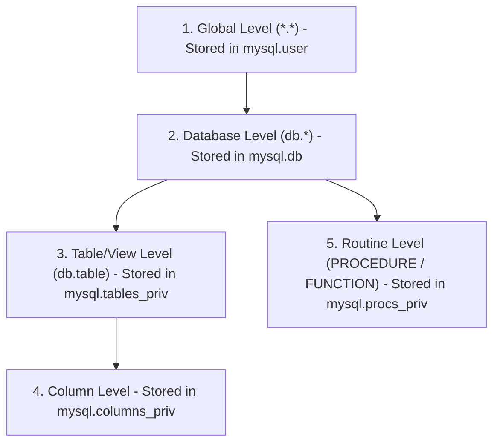
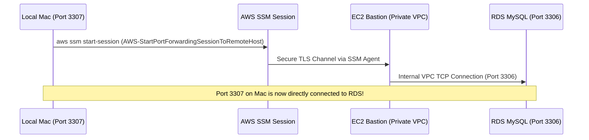

# Comprehensive MySQL Permissions, Views & AWS SSM Troubleshooting Guide

## 1. Executive Summary & Core Concepts

Managing database permissions for automated pipelines, data engineers, and deployment scripts often encounters friction when permissions are either too coarse (security risk) or too restrictive (breaking deployments).

This reference document explains:
1. **The MySQL Privilege Model & Inheritance Hierarchy**
2. **View-Specific Permissions (`SHOW VIEW`, `CREATE VIEW`, `DROP`)**
3. **Common MySQL Error Codes & Exact Root Causes**
4. **AWS SSM Remote Access & Port-Forwarding Workflows**
5. **CLI Productivity & Debugging Cheat Sheet**

---

## 2. The MySQL Privilege Hierarchy

MySQL enforces permissions at five distinct granular levels. A higher level grants access to all lower levels, while a lower level allows fine-grained access control.



### The Identity Rule: `'user'@'host'`
In MySQL, a user is not just a username. A user account is **always** defined as `'username'@'hostname_or_ip'`:
* `'analytics'@'%'`: Matches the `analytics` user connecting from **any remote host/IP**.
* `'analytics'@'localhost'`: Matches connections originating **locally on the server** (e.g. Unix socket or 127.0.0.1 on the DB host).
* `'analytics'@'10.4.3.230'`: Matches connections originating from that **exact private IP address**.
* `'analytics'@'10.4.%.%'`: Matches any IP within the `10.4.0.0/16` subnet.

> [!IMPORTANT]
> **Precedence Rule**: MySQL sorts accounts by most specific host first when authenticating. An exact IP match (`'analytics'@'10.4.3.230'`) takes precedence over a wildcard (`'analytics'@'%'`). If both exist, grant permissions to the one being actively resolved.

---

## 3. Deep Dive: View Permissions & Lifecycle

Views are virtual tables compiled from a `SELECT` query. Because of this, creating and updating views has unique privilege rules:

| Operation | Required Privilege | Reason |
| :--- | :--- | :--- |
| `SELECT * FROM v_myview` | `SELECT` on View | Allows reading the compiled view data. |
| `SHOW CREATE VIEW v_myview` | `SHOW VIEW` + `SELECT` on View | Exposes the raw underlying SQL statement. |
| `CREATE VIEW v_myview AS ...` | `CREATE VIEW` on DB or View + `SELECT` on base tables | Allows storing the new virtual table definition. |
| `DROP VIEW v_myview` | `DROP` on DB or View | Allows destroying the existing view. |
| `CREATE OR REPLACE VIEW v_myview AS ...` | `CREATE VIEW` + **`DROP`** | If the view exists, MySQL must drop it before recreating it. |

### Why Deepika's Script Failed with `ERROR 1142`
Deployment scripts for views typically begin with:
```sql
DROP VIEW IF EXISTS v_pdftemplate_ENDOR_InitialVrs;
CREATE VIEW v_pdftemplate_ENDOR_InitialVrs AS ...
-- OR:
CREATE OR REPLACE VIEW v_pdftemplate_ENDOR_InitialVrs AS ...
```

In your database, `SHOW GRANTS FOR 'analytics'@'%'` showed:
```text
GRANT SELECT, SHOW VIEW ON `qreport_prod`.`v_pdftemplate_ENDOR_InitialVrs` TO `analytics`@`%`
```
* It had `SELECT` (reading).
* It had `SHOW VIEW` (inspecting DDL).
* **It was missing `DROP` and `CREATE VIEW` at the view level!**

All other template views had `GRANT DROP ON ...`, which is why only `v_pdftemplate_ENDOR_InitialVrs` failed.

---

## 4. Troubleshooting Matrix: Error Codes Decoded

### Error 1142 (42000): Command denied to user
* **Symptom**: `ERROR 1142 (42000): DROP command denied to user 'analytics'@'10.4.3.230' for table 'v_pdftemplate_ENDOR_InitialVrs'`
* **Root Cause**: The user account does not have the specified privilege (`DROP`, `SHOW VIEW`, `SELECT`, etc.) for that object.
* **Fix**:
  ```sql
  GRANT DROP, CREATE VIEW, SHOW VIEW, SELECT ON qreport_prod.v_pdftemplate_ENDOR_InitialVrs TO 'analytics'@'%';
  FLUSH PRIVILEGES;
  ```

---

### Error 1146 (42S02): Table doesn't exist
* **Symptom**: `ERROR 1146 (42S02): Table 'qreport.WebhookLog' doesn't exist`
* **Root Cause**: Wrong database prefix. When connected to database `qreport_shopify`, prefixing with `qreport.WebhookLog` instructs MySQL to search in a separate database called `qreport`.
* **Fix**:
  ```sql
  -- Either omit the prefix (uses current DB):
  SELECT * FROM WebhookLog LIMIT 10;
  -- Or use the correct schema prefix:
  SELECT * FROM qreport_shopify.WebhookLog LIMIT 10;
  ```

---

### Error 1045 (28000): Access denied for user
* **Symptom**: `ERROR 1045 (28000): Access denied for user 'admin'@'localhost' (using password: YES)`
* **Root Cause**: When port-forwarding to local port `3306`, your connection was intercepted by a local `mysqld` service already running on your Mac (`PID 3204`), instead of forwarding to AWS RDS.
* **Fix**: Forward to an unused local port such as `3307`:
  ```bash
  --parameters '{"host":["...rds.amazonaws.com"],"portNumber":["3306"],"localPortNumber":["3307"]}'
  ```

---

### Error 2003 (HY000): Can't connect to MySQL server
* **Symptom**: `ERROR 2003 (HY000): Can't connect to MySQL server on '127.0.0.1:3307' (61)`
* **Root Cause**: Nothing is listening on port 3307. The background SSM port-forwarding session was either never started or crashed.
* **Fix**: Launch the `aws ssm start-session` command first and ensure it shows `Waiting for connections...`.

---

## 5. AWS Systems Manager (SSM) Port-Forwarding Runbook

When your RDS instance resides in a private VPC without public IP access, use an SSM-managed EC2 instance (Bastion/Jumpbox) to tunnel the connection.



### Prerequisites
1. **AWS CLI** configured with an active profile:
   ```bash
   aws configure list-profiles
   aws sso login --profile q-report   # If using AWS SSO
   ```
2. **Session Manager Plugin** installed:
   ```bash
   brew install --cask session-manager-plugin
   session-manager-plugin   # Verifies installation
   ```

### Step-by-Step Tunnel Command

#### Terminal 1: Keep Tunnel Alive
```bash
aws ssm start-session \
  --profile q-report \
  --region ap-southeast-2 \
  --target i-095d6f55a80fc2c95 \
  --document-name AWS-StartPortForwardingSessionToRemoteHost \
  --parameters '{"host":["qreport-nonproduction.c5g4ncau2qu6.ap-southeast-2.rds.amazonaws.com"],"portNumber":["3306"],"localPortNumber":["3307"]}'
```
*Wait until you see:*
```text
Port 3307 opened for sessionId ...
Waiting for connections...
```

#### Terminal 2: Run Queries or Connect GUI Tools
* **CLI Query direct to file**:
  ```bash
  mysql -h 127.0.0.1 -P 3307 -u admin -p'YOUR_PASSWORD' qreport_shopify -E -e "SELECT * FROM WebhookLog ORDER BY receivedAt DESC LIMIT 10" > ~/Desktop/output.txt
  ```
* **CLI Query direct to Mac Clipboard**:
  ```bash
  mysql -h 127.0.0.1 -P 3307 -u admin -p'YOUR_PASSWORD' qreport_shopify -E -e "SELECT * FROM WebhookLog ORDER BY receivedAt DESC LIMIT 10" | pbcopy
  ```
* **GUI Tools (DBeaver / TablePlus / DataGrip)**:
  * Host: `127.0.0.1`
  * Port: `3307`
  * User: `admin`
  * Password: `YOUR_PASSWORD`

---

## 6. MySQL CLI Productivity Tips & Tricks

### 1. Vertical Output: `-E` vs `\G`
* **Inside interactive MySQL**: End your statement with `\G` instead of `;`:
  ```sql
  SELECT * FROM WebhookLog LIMIT 1\G
  ```
* **From Bash/Zsh scripts (`mysql -e ...`)**: Use the **`-E`** flag!
  ```bash
  # Correct:
  mysql -u user -p -E -e "SELECT * FROM WebhookLog LIMIT 5"
  # Avoid inside double quotes: -e "SELECT * FROM WebhookLog \G" (causes '\G unknown command' error in zsh)
  ```

### 2. The `tee` Command for Session Logging
Capture interactive query output to a clean file on the fly:
```sql
mysql> tee /tmp/query_audit.log
Logging to file '/tmp/query_audit.log'

mysql> SELECT * FROM MeasurementEvent LIMIT 5\G
-- (Output prints to terminal AND writes to file)

mysql> notee
Outfile disabled.
```

### 3. Pager Support (`less`)
Stop multi-screen table outputs from flooding your scroll buffer:
```sql
mysql> pager less -SFX
PAGER set to 'less -SFX'

mysql> SELECT * FROM WebhookLog;
-- (Now browse with keyboard arrows, press 'q' to exit)

mysql> nopager
PAGER set to stdout
```

---

## 7. DBA Diagnostic & Audit Script

When auditing user permissions, run these diagnostic queries:

```sql
-- 1. Check all user hosts
SELECT User, Host, account_locked, password_expired 
FROM mysql.user 
WHERE User = 'analytics';

-- 2. Inspect active grants
SHOW GRANTS FOR 'analytics'@'%';

-- 3. Check table and view level permissions directly
SELECT User, Host, Db, Table_name, Table_priv, Column_priv 
FROM mysql.tables_priv 
WHERE User = 'analytics';

-- 4. Check routine (Stored Procedure / Function) permissions
SELECT User, Host, Db, Routine_name, Routine_type, Proc_priv 
FROM mysql.procs_priv 
WHERE User = 'analytics';

-- 5. Inspect view definitions in information_schema
SELECT TABLE_SCHEMA, TABLE_NAME, DEFINER, SECURITY_TYPE, VIEW_DEFINITION 
FROM information_schema.VIEWS 
WHERE TABLE_NAME = 'v_pdftemplate_ENDOR_InitialVrs';
```

---

## 8. When is `FLUSH PRIVILEGES` Actually Required?

* **When you use DCL Statements (`GRANT`, `REVOKE`, `CREATE USER`, `DROP USER`)**:
  * MySQL modifies internal memory structures immediately. `FLUSH PRIVILEGES` is **not strictly necessary**, but harmless.
* **When you modify `mysql.*` tables directly using DML (`INSERT INTO mysql.user`, `UPDATE mysql.tables_priv`)**:
  * MySQL **does not** automatically re-read table privileges into memory. You **MUST** run `FLUSH PRIVILEGES`.
* **Best Practice**: Running `FLUSH PRIVILEGES;` after manual permission grants is standard operational hygiene to guarantee in-memory cache sync.
