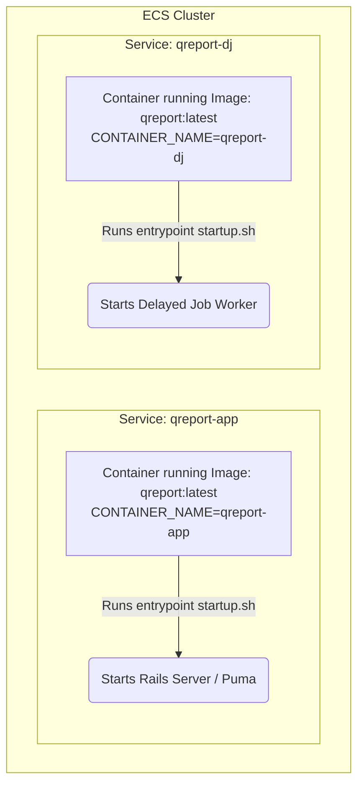

# DevOps Engineering Guide: Mono-Image ECS Architecture & CI/CD Pipeline

Welcome! As a junior DevOps engineer, mastering container design patterns and continuous integration/continuous deployment (CI/CD) pipelines on AWS is a major milestone. 

This guide breaks down the architecture of the **QReport** infrastructure. It explains why we use a single Docker image for multiple services, details the CI/CD pipeline, and provides **10 logical DevOps questions** to test and expand your knowledge.

---

## 1. The "Mono-Image" Architecture Pattern

In a typical production environment, you have multiple running components of the same application. For a Ruby on Rails application like QReport, these usually are:
1. **The Web Server (`qreport-app`)**: Handles incoming HTTP/HTTPS requests, renders views, and serves the API.
2. **The Background Job Processor (`qreport-dj`)**: Processes long-running asynchronous tasks (such as sending emails, generating reports, or running heavy database tasks) via a queue manager like **Delayed Job** (DJ).

### Single Image vs. Multiple Images

Here is a comparison of how you can deploy these two components:

| Feature | The Multi-Image Approach (Two Images) | The Mono-Image Approach (One Image) - **Used Here** |
| :--- | :--- | :--- |
| **Dockerfiles** | Two separate `Dockerfile.web` and `Dockerfile.worker`. | One single `Dockerfile`. |
| **CI Build Time** | Double the build time (must build, tag, and push two images). | Normal build time (build once, push once). |
| **ECR Storage** | Twice the storage cost and registry clutter. | Single repository, minimal clutter. |
| **Version Drift** | High risk: Web app could deploy code version `v1.2` while workers are running `v1.1`. | Zero risk: Both containers run the exact same image hash. |
| **Bootstrapping** | Configured inside Docker build. | Configured at container runtime using environment variables. |

### How It Works: Environment-Driven Bootstrapping

Under the hood, the two ECS services use the same image but start different processes based on the `CONTAINER_NAME` environment variable.



The ECS Task Definition specifies the Entrypoint as `["/bin/bash", "startup.sh"]`. When the container starts, the shell script executes:

```bash
#!/bin/bash
# startup.sh

# Run migrations (typically only on the web app instance during start)
if [ "$CONTAINER_NAME" = "qreport-app" ]; then
  bundle exec rails db:migrate
  bundle exec rails server -b 0.0.0.0 -p 3000
elif [ "$CONTAINER_NAME" = "qreport-dj" ]; then
  bundle exec bin/delayed_job run
else
  echo "Invalid CONTAINER_NAME specified"
  exit 1
fi
```

---

## 2. Complete CI/CD Pipeline Flow

Here is exactly what happens when you push a code change to GitHub:

### Phase 1: Source Phase (CodePipeline & GitHub)
1. A push occurs on the configured branch (e.g., `staging` or `production`).
2. AWS CodeStar Connection notifies CodePipeline via a webhook.
3. CodePipeline retrieves the workspace files as a ZIP archive and saves it to the S3 bucket configured in `artifact_store` (e.g., `sydney-qreport-pipeline-bucket`).

### Phase 2: Build Phase (CodeBuild & Secrets Manager)
1. CodePipeline triggers CodeBuild and downloads the ZIP code bundle into the CodeBuild build environment.
2. CodeBuild maps environment variables from AWS Secrets Manager (e.g., Google Maps API key, Slack Webhook URL) and standard variables (e.g., `REPOSITORY_URI`, `ENVIRONMENT_NAME`).
3. **Slack Alert:** CodeBuild sends a webhook post to Slack indicating the build has started.
4. **Docker login:** Logs into the ECR Registry.
5. **Docker Build:** Runs `docker build` passing the dynamic keys as `--build-arg`. This builds a single image and tags it as both `latest` and a unique timestamp (e.g., `staging-2026-08-05.20.54.52`).

### Phase 3: Deploy Phase (ECR & ECS)
1. CodeBuild pushes both Docker tags to the Amazon ECR registry.
2. CodeBuild runs the AWS CLI command to force deployment of ECS services:
   ```bash
   aws ecs update-service --cluster $CLUSTER --service qreport-app --force-new-deployment
   aws ecs update-service --cluster $CLUSTER --service qreport-dj --force-new-deployment
   ```
3. ECS initiates a **Rolling Update**:
   - Spins up new tasks pulling the fresh container image from ECR.
   - Health checks verify that the new container is healthy.
   - Routes traffic to the new web containers and stops the old web/worker containers.

---

## 3. DevOps Quiz: 10 Logical Concept Questions

To cement your understanding of this architecture, review and answer the following questions. (Detailed answers are listed below).

### Question 1: Why don't we run migrations in both `qreport-app` and `qreport-dj` containers at startup?
*Hint: What happens if both containers try to execute `rails db:migrate` at the exact same millisecond?*

### Question 2: Why are frontend keys (e.g. `REACT_APP_GOOGLE_MAPS_API_KEY`) passed as `--build-arg` in Docker build, while Database URLs are passed as runtime environment variables?
*Hint: Think about where React code runs vs. where Rails database connections are established.*

### Question 3: How does the docker layer cache behave during `docker build` if you modify a minor application code file vs. modifying your `Gemfile`?
*Hint: Look at how `COPY` commands are structured in standard Dockerfiles.*

### Question 4: What is the difference between `memory` (hard limit) and `memoryReservation` (soft limit) in the ECS container definition?
*Hint: See lines 33 and 35 in the HCL file.*

### Question 5: What is the purpose of `--force-new-deployment` in the `aws ecs update-service` command? What happens if you run the deploy without it, and the tag is just `latest`?
*Hint: How does ECS determine if a container configuration has changed?*

### Question 6: In your Terraform template, `initProcessEnabled` is set to `true` for `qreport-app` but `false` for `qreport-dj`. Why does an ECS container need an init process?
*Hint: Think about PID 1, signal handling (SIGTERM), and zombie processes.*

### Question 7: Why is it critical that CodePipeline's S3 artifact bucket has versioning enabled?
*Hint: Look at lines 4-6 and 14-16 in `s3.tf`.*

### Question 8: In `buildspec.yml`, if a secret in Secrets Manager is updated, does the running ECS container receive the update immediately?
*Hint: When does CodeBuild fetch Secrets Manager variables? When does ECS fetch task variables?*

### Question 9: What is a potential issue with doing deployments directly from CodeBuild shell commands (Sydney method) instead of using the CodePipeline Deploy action (Singapore method)?
*Hint: How does CodePipeline know if the deployment on ECS succeeded or failed?*

### Question 10: If a buggy image is pushed and the web application crashes at boot, how does ECS prevent downtime?
*Hint: Think about target groups, health checks, and rolling deployments.*

---

## 4. Quiz Explanations & Answers

### Answer 1: Database Locks & Race Conditions
If multiple containers attempt to run migrations concurrently, they might execute duplicate DDL statements (e.g., attempting to create the same table twice), resulting in SQL errors and startup failure. By checking `if [ "$CONTAINER_NAME" = "qreport-app" ]`, only the web container runs migrations, preventing race conditions.

### Answer 2: Client-side vs. Server-side Execution
* **React** runs in the user's web browser, not on the server. Because the browser has no access to AWS Secrets Manager, React configuration keys must be baked into the compiled Javascript bundle at build time using `--build-arg`.
* **Database URLs** are used on the backend server by Rails. They must be loaded dynamically at runtime (via ECS Task environment parameters) so that secrets are never saved inside the static Docker image (which would be a security risk).

### Answer 3: Docker Layer Invalidation
Docker caches build steps in sequence. 
* If you modify a **code file** (e.g., `app/controllers/users_controller.rb`), Docker caches everything up to the `COPY . .` step. The install step (`bundle install`) is skipped because the `Gemfile` didn't change, saving build time.
* If you modify the **`Gemfile`**, the cache is invalidated early. Docker must re-run `bundle install`, downloading all dependencies from scratch.

### Answer 4: Hard vs. Soft Memory Limits
* **`memory` (Hard Limit)**: If the container consumes more than this amount of memory, the Linux kernel OOM (Out Of Memory) killer terminates the process instantly.
* **`memoryReservation` (Soft Limit)**: The container is allocated this amount of memory to run. If the host has spare capacity, the container can temporarily exceed this limit up to the hard limit.

### Answer 5: Triggering Updates on Immutable Tags
By default, if you push a new image to ECR with the tag `latest`, ECS does not know the image has changed because the tag name is still `latest`. Running `--force-new-deployment` instructs ECS: *"Ignore the fact that task variables haven't changed; spin down the old tasks and pull the latest image content from ECR anyway."*

### Answer 6: Signal Routing (PID 1)
In Linux, the process running as PID 1 is responsible for reaping orphan processes ("zombies") and passing termination signals (like `SIGTERM`) down to child processes. 
* Setting `initProcessEnabled = true` configures ECS to inject a tiny init system (like `tini`) as PID 1.
* This ensures that when ECS stops a task, the container shuts down gracefully instead of hanging and getting force-killed after the default 30-second timeout.

### Answer 7: CodePipeline State Management
AWS CodePipeline relies on S3 Object Versioning to track changes to the artifacts. Every execution reference has a unique S3 Object Version ID. Without versioning enabled, CodePipeline cannot accurately trigger stages or retrieve historical build artifacts.

### Answer 8: Build-time vs. Runtime Secrets
No. Secrets mapped under `secrets-manager` in `buildspec.yml` are loaded **only during the CodeBuild execution phase** to bake variables or run scripts. The running ECS containers will not see these changes until a new build compiles a new image or restarts. If you want runtime secrets updates, they must be mapped directly in the ECS Task Definition using the `secrets` section.

### Answer 9: Pipeline Pipeline Visibility (Failure Detection)
* **CodeBuild deployment (Sydney)**: CodePipeline considers the "Build" stage successful as soon as CodeBuild exits with code `0`. CodePipeline has no awareness of whether the ECS service rollout actually succeeds or hangs.
* **CodePipeline Deploy (Singapore)**: CodePipeline manages the deployment stage. If the ECS task fails its health checks and rollbacks, CodePipeline marks the deploy stage as `FAILED`, giving clear pipeline visibility.

### Answer 10: ECS Rolling Update & Health Checks
During a deployment, ECS uses a rolling update strategy (governed by `minimum_healthy_percent`). It starts the new container task alongside the old one. The Application Load Balancer (ALB) runs health checks on the new container. Traffic is only redirected once the checks pass. If the new container crashes at boot, it fails health checks, the deploy halts, and the old container remains online, resulting in zero user downtime.
