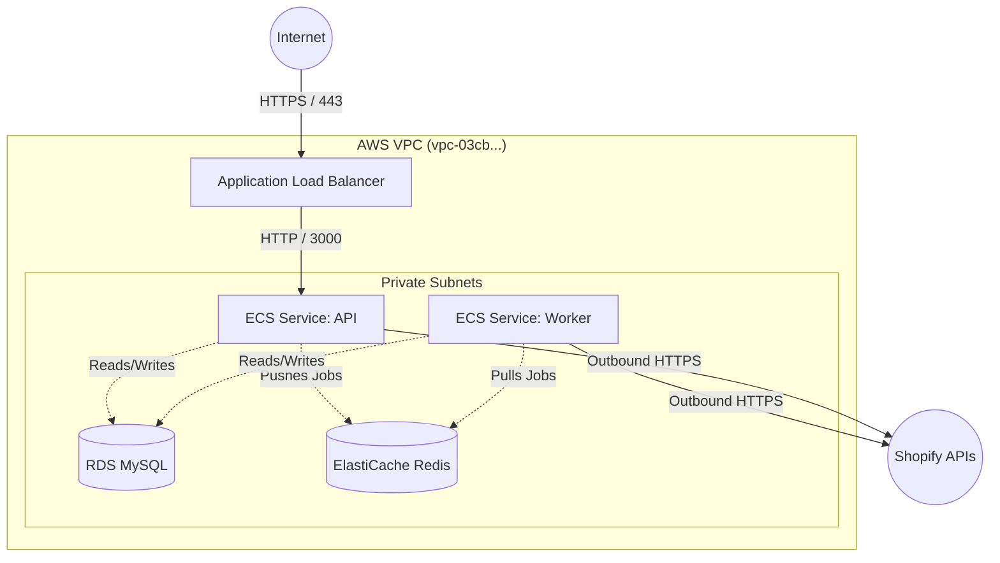

# 📘 The Complete DevOps Manual: QReport Shopify Lead Integration App

> **Note on Diagrams:** The diagrams below are written in `mermaid` syntax. If they look like code blocks instead of visual diagrams, it means your current Markdown Viewer (e.g., VSCode) doesn't have Mermaid support installed. You can install the **"Markdown Preview Mermaid Support"** extension in VSCode, or view this file on GitHub, which renders them automatically as images!

---

## Part 1: Understanding the Application (The DevOps Perspective)

As a DevOps Engineer, you don't need to write the application code, but you **must** understand how the application breathes, stores state, and interacts with the outside world. If you deploy a black box, you cannot scale it or debug it when it breaks.

### 1.1. What is the QReport Shopify Lead Integration App?
This application acts as a bridge between a merchant's Shopify store and the QReport CRM. 
1. **OAuth Flow:** A merchant installs the app on their Shopify store. The app negotiates an OAuth token with Shopify and stores it in our database.
2. **Webhooks:** The app subscribes to Shopify webhooks (e.g., `orders/create`, `customers/create`). When a customer does something on Shopify, Shopify fires an HTTP POST request to our application.
3. **Data Syncing:** The app receives this webhook, processes the payload, transforms it, and pushes it to the QReport CRM.

### 1.2. The "DevOps Matrix" (What you actually care about)
When looking at this Node.js app, here is your cheat sheet of its physical requirements:

| Component | Technology | DevOps Implication |
| :--- | :--- | :--- |
| **Compute** | Node.js (Express) | Single-threaded. If it does heavy CPU work, it blocks the event loop. Must be horizontally scaled via ECS. |
| **Primary Database** | MySQL (AWS RDS) | Relational state. Requires a connection pool. Migrations must run *before* the new code boots. |
| **Cache & Queues** | Redis (ElastiCache) | Used for session storage and background job queues (BullMQ). If Redis dies, user sessions log out. |
| **External APIs** | Shopify API, QReport API | Rate limiting is a huge factor. The app cannot blast Shopify with 1000 requests/sec. |

### 1.3. Why does it need a Background Worker?
Shopify mandates that when they send a webhook (e.g., a new order), your app **must respond with a 200 OK within 5 seconds**. If your app takes 10 seconds to sync that order to QReport, Shopify assumes your app is broken and will eventually delete your webhook subscription.

**The DevOps Architecture required:**
1. **API Container (Web):** Receives the webhook, instantly pushes the payload into Redis (Queue), and immediately returns `200 OK` to Shopify (takes 50ms).
2. **Worker Container (Background):** A completely separate ECS service that silently pulls jobs from Redis and does the heavy 10-second sync to QReport.

*If the API container goes down, Shopify drops webhooks. If the Worker goes down, webhooks just pile up in Redis safely until the worker comes back online.*

---

## Part 2: Infrastructure Architecture & Network Topology

To securely host this application, we use AWS. Here is the layout of the VPC (Virtual Private Cloud).



### 2.1. Security Groups (Firewalls)
As a DevOps engineer, you control traffic flow. 
* **ALB Security Group:** Allows `Inbound 443` (HTTPS) and `80` (HTTP) from `0.0.0.0/0` (The Internet).
* **ECS Security Group:** Allows `Inbound 3000` ONLY from the ALB Security Group. (No one can bypass the ALB to hit the container directly).
* **RDS & Redis Security Groups:** Allow `Inbound 3306` (MySQL) and `6379` (Redis) ONLY from the ECS Security Group.

---

## Part 3: The CI/CD Pipeline (CodeBuild to ECS)

How does code get from a developer's laptop to production safely?

### 3.1. The Flow
1. Developer pushes to GitHub branch (`devops` or `main`).
2. AWS CodeBuild triggers via a webhook.
3. CodeBuild provisions a temporary Linux server.
4. It reads the `buildspec.yml`.

### 3.2. Detailed `buildspec.yml` Phase Breakdown

#### Phase 1: Authentication & Preparation
CodeBuild needs to log into AWS ECR so it can push Docker images.
```yaml
aws ecr get-login-password --region $AWS_DEFAULT_REGION | docker login --username AWS --password-stdin $AWS_ACCOUNT_ID.dkr.ecr.$AWS_DEFAULT_REGION.amazonaws.com
```

#### Phase 2: Building the Image
We build the `Dockerfile.app` using the short Git SHA as the tag. Why not `latest`? Because if you deploy `latest` and it breaks, you can't easily roll back. With Git SHAs, you know exactly what code is running.
```yaml
GIT_SHA=$(echo "${CODEBUILD_RESOLVED_SOURCE_VERSION}" | cut -c 1-10)
SHOPIFY_IMAGE_NAME=${ECR_REPO_URL}/${APP_NAME}:${GIT_SHA}
docker build -t ${SHOPIFY_IMAGE_NAME} -f ./ci-cd/Dockerfile.app .
docker push ${SHOPIFY_IMAGE_NAME}
```

#### Phase 3: Terraform Execution
Terraform takes over. It reads the AWS account state and updates the ECS Task Definition to use the new Docker image.
```yaml
# Inject the new image URL into tfvars so Terraform knows about it
echo "image_url = \"${SHOPIFY_IMAGE_NAME}\"" >> staging.tfvars

terraform init -reconfigure --backend-config=backend-config/staging.conf
terraform workspace select staging
terraform apply -var-file=staging.tfvars -auto-approve
```

---

## Part 4: Dockerization Strategy for Node.js

Node.js dockerization is tricky because of `node_modules` that contain C++ binaries (like `bcrypt` for password hashing, or `canvas` for image manipulation).

### 4.1. The "Base Image" Pattern
Running `npm install` takes 2 to 5 minutes. If a developer fixes a typo in a `.js` file, they shouldn't have to wait 5 minutes for the pipeline. We separate the Dockerfiles.

**`Dockerfile.base` (The Dependencies)**
```dockerfile
FROM node:18-alpine
# Install Python and build tools for C++ node modules
RUN apk add --no-cache make gcc g++ python3
WORKDIR /app
COPY package.json package-lock.json ./
RUN npm ci --only=production
```
*You only build this once a month when package.json changes.*

**`Dockerfile.app` (The Application)**
```dockerfile
# Pull the pre-built node_modules from ECR
FROM 463949419568.dkr.ecr.ap-southeast-2.amazonaws.com/qreport-base:latest
WORKDIR /app
# Copy the rapid-changing source code
COPY src/ ./src
COPY ci-cd/startup.sh ./
RUN chmod +x startup.sh
ENTRYPOINT ["./startup.sh"]
CMD ["node", "src/index.js"]
```
*This builds in 2 seconds.*

---

## Part 5: Secrets & Environment Variables Configuration

Never store database passwords in `.env` files committed to Git. In AWS ECS, we handle secrets using **AWS Secrets Manager** and **Terraform**.

### 5.1. Terraform Secret Injection
In our ECS Task Definition Terraform code, we map secrets directly from AWS Secrets Manager to Environment Variables inside the container.

```hcl
container_definitions = jsonencode([
  {
    name = "qreport-shopify"
    secrets = [
      {
        name      = "DATABASE_URL"
        valueFrom = "arn:aws:secretsmanager:ap-southeast-2:463949419568:secret:staging/db_url-XyZ123"
      }
    ]
  }
])
```
**How it works:** When ECS boots the container, the ECS Agent pauses, calls Secrets Manager, gets the password, and injects it into the container's memory as `process.env.DATABASE_URL`. The code never knows it came from Secrets Manager!

---

## Part 6: Process Management & Graceful Shutdowns

### 6.1. The `startup.sh` Entrypoint
When a container boots, it shouldn't just start the web server. It needs to check if the database is ready and run migrations.

```bash
#!/bin/sh
set -e # Crash the container if anything below fails

echo "Running Database Migrations..."
npm run migrate

echo "Starting Web Server..."
# Using exec is CRITICAL. It replaces the shell process with Node.js.
exec "$@"
```

### 6.2. Why `exec` matters (Graceful Shutdown)
If you don't use `exec "$@"`, the container runs `/bin/sh` as Process ID 1 (PID 1), and Node.js as PID 2. 
When AWS wants to deploy a new version, it sends a `SIGTERM` kill signal to PID 1 (the shell). The shell ignores it. 30 seconds later, AWS forcefully pulls the power cord (`SIGKILL`), terminating active user requests instantly.
By using `exec`, Node.js becomes PID 1.

**Application Code:**
```javascript
process.on('SIGTERM', () => {
  console.log('Received SIGTERM. Stopping HTTP traffic...');
  httpServer.close(() => {
    console.log('HTTP closed. Disconnecting database...');
    db.close();
    process.exit(0);
  });
});
```

---

## Part 7: Troubleshooting Playbooks (Runbooks)

As a DevOps engineer, you are the firefighter. Here are the playbooks for common issues you will face with this application.

### 🔥 Playbook A: "Creation of service was not idempotent" (Ghost Services)
**Symptom:** `terraform apply` fails instantly with an idempotency error on the ECS service.
**Root Cause:** You manually deleted `.tfstate` without running `terraform destroy`. The ECS service in AWS was deleted and became `INACTIVE`. Terraform tried to recreate a service with the exact same name, colliding with the AWS tombstone.
**Resolution:**
1. You cannot easily purge an `INACTIVE` service. AWS does it in the background over several hours.
2. The fastest fix is to rename the service in your Terraform module.
   * Edit `main.tf` to change `name = "${var.app_name}-${var.environment}"` to `name = "${var.app_name}-${var.environment}-v2"`.
   * Re-run the pipeline.

### 🔥 Playbook B: Container keeps dying (CrashLoopBackOff)
**Symptom:** ECS says the service is stuck deploying, and tasks are continually transitioning from `PENDING` to `STOPPED`.
**Root Cause:** The Node.js application is throwing a fatal error on boot (e.g., bad database password, missing syntax).
**Resolution:**
1. Look at the CloudWatch logs.
   ```bash
   aws logs get-log-events --log-group-name /ecs/qreport-shopify-staging --log-stream-name ecs/qreport-shopify/12345
   ```
2. If logs don't show the error (e.g., it crashes before logging), override the container entrypoint locally to drop into a shell and test it manually:
   ```bash
   docker run -it --entrypoint /bin/sh 463949419568.dkr.ecr.ap-southeast-2.amazonaws.com/qreport-shopify:latest
   # Inside the container:
   node src/index.js
   ```

### 🔥 Playbook C: "binding.node / invalid ELF header"
**Symptom:** App crashes on boot with an error complaining about a C++ binary or `ELF header`.
**Root Cause:** The developer ran `npm install` on their Apple Macbook (ARM architecture) and accidentally pushed the `node_modules` folder to Git, or copied it into a Linux container without recompiling.
**Resolution:**
1. Ensure `.dockerignore` contains `node_modules`.
2. Ensure the Dockerfile always runs `npm ci` inside the container itself.

### 🔥 Playbook D: Shopify Webhooks are failing / timing out
**Symptom:** Shopify dashboard shows webhooks are failing to deliver.
**Root Cause:** Your API container is processing the heavy webhook synchronously instead of using the Background Worker. It is taking longer than 5 seconds to reply to Shopify.
**Resolution:**
1. Check the CPU utilization of the API container in CloudWatch. If it's spiking to 100%, Node's event loop is blocked.
2. Review the application logic. Ensure the API endpoint does `Queue.add(webhookData)` and immediately calls `res.status(200).send()`.

### 🔥 Playbook E: "Image is not getting replaced during deployment" (The Dynamic Tag Issue)
**Symptom:** Your pipeline says "Deployment successful", but the ECS containers are still running old code. 
**Root Cause (The "Before"):** In Terraform, the `image` property of the `aws_ecs_task_definition` was likely hardcoded to something generic like `my-repo:latest`. When you push new code to ECR, the image content changes, but the string `my-repo:latest` stays exactly the same. When `terraform apply` runs, Terraform compares its state and thinks, *"The image string hasn't changed, so I don't need to update the Task Definition."* As a result, ECS never pulls the new image.
**Resolution (The "After"):**
1. We modified the `buildspec.yml` to dynamically tag the Docker image with a unique Git SHA (e.g., `my-repo:a1b2c3d4`).
2. Then, we injected that exact, unique string into Terraform variables during the pipeline:
   ```bash
   echo "image_url = \"${SHOPIFY_IMAGE_NAME}\"" >> staging.tfvars
   ```
3. **The Aftermath:** Now, when `terraform apply` runs, it sees the string change (from `my-repo:old-sha` to `my-repo:new-sha`). Terraform explicitly creates a new Task Definition revision and forces ECS to do a rolling update to the new code. Always use unique image tags!

---

## Part 8: Advanced Terraform State Surgery

Sometimes, you need to hack Terraform to fix a desynchronized state without destroying production infrastructure.

### 8.1. State Manipulation Commands
* **List everything Terraform manages:**
  ```bash
  terraform state list
  ```
* **Make Terraform "forget" a resource:**
  If an AWS resource was deleted manually in the console, Terraform will crash trying to modify it. Remove it from Terraform's memory:
  ```bash
  terraform state rm module.ecs.aws_ecs_service.main
  ```
* **Target a specific resource for apply:**
  If you only want to update the load balancer and ignore changes to ECS for a moment:
  ```bash
  terraform apply -target=module.ecs.aws_lb_listener_rule.app
  ```

---

## Conclusion
This manual equips you with the architecture knowledge, pipeline configurations, Node.js deployment paradigms, and disaster recovery playbooks required to professionally manage the QReport Shopify Lead Integration App in production. Keep this guide updated as the infrastructure evolves!
